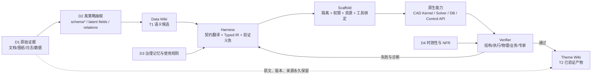

# 工业软件不可逼近层与 Agentic 信息提取边界

## 0. 目的与证据等级

本文以深观启元的行业评论[《论 AI 的能力圈与工业软件的“不可逼近层”》](https://news.popyard.space/cn16scroll22573520.html)（2026-08-22，Popyard 为转载页）为问题入口，结合当前的三层 Agentic Runtime 与数据平面设计，回答两个问题：

1. LLM 在工业软件中应负责什么，不应被默认为什么负责？
2. 信息抽取结果何时只是语义候选，何时才能成为可执行、可复用的工程事实？

证据等级需要严格区分：

- **行业评论**：用于提出问题和观察产业边界，不能替代原始实验、产品文档或财务材料。
- **论文**：本次检索范围为 arXiv 编号 `2606.*`—`2608.*`，即晚于 `2605` 的工作；arXiv 是分发渠道，其中部分论文标注为会议论文，部分仍是预印本，结论应按各自实验规模理解。
- **架构推论**：下文对 `A = <S,H,X>` 与 `D = <D1,D2,D3,D4,Ω>` 的扩展属于本文设计判断，需要通过系统实验而非引用本身证明。

> [!summary]
> **核心结论**：LLM 更适合承担语义提议、信息抽取、计划生成和流程编排；Typed IR 与 Harness 承担契约翻译和晋级门；几何内核、物理求解器、数据库、权限系统等原生能力承担执行与验证。信息链路必须保留原文、来源与版本，只有经过结构、执行或专家验证的产物才能从 Data Wiki 晋级到 Theme Wiki。

“不可逼近层”不宜解释为数学意义上的永久不可达，而应解释为：在给定可靠性、可追溯性、责任边界和成本约束下，通用生成模型暂时不能经济地替代的工程层。随着模型、隐式几何、可微分求解器和数据积累进步，这条边界会移动，但**语义生成与确定性执行之间仍需要显式契约**。

## 1. 文章的主要论点

文章把工业软件拆为三层：

| 文章层次 | 主要内容 | AI 的现实作用 | 暂不能省略的锚点 |
|---|---|---|---|
| 交互层 | 自然语言、界面、知识问答 | 理解意图、降低使用门槛 | 权限、上下文与责任边界 |
| 工作流层 | 参数准备、流程编排、自动化 | 生成方案、调用工具、反馈修订 | 状态管理、约束、审计、失败处理 |
| 核心层 | 几何内核、PDE/FEA 求解、工程数据库 | 提供候选、近似、加速与搜索 | 精确几何、收敛性、物理一致性、可追溯数据 |

文章对三个“硬边界”的判断是：

1. **几何边界**：LLM 可以把设计意图转成 CAD 操作或程序，但精确 B-Rep/NURBS 建模、拓扑一致性和可编辑特征依赖仍需几何内核执行。
2. **物理边界**：代理模型可以加速搜索和近似预测，但工程签核仍需要守恒、边界条件、收敛和误差可解释的求解与验证。
3. **数据边界**：RAG 可以暴露已有数据，却不能凭空生成缺失的工程经验；异构格式、质量、权限、时效性和责任链仍是核心问题。

因此，文章隐含的系统模式不是“AI 替代工业软件”，而是：

> **AI 负责提出和编排，工业内核负责执行和裁决。**

## 2. 与三层 Agentic Runtime 的映射

当前架构为：

```text
A = <S, H, X>

S = Skills
H = Harness
X = Scaffold
```

数据平面独立表示为：

```text
D = <D1, D2, D3, D4, Ω>
```

其中：

- `D1`：在线原始数据访问；
- `D2`：独立、离策略的语义总结与结构发现；
- `D3`：治理记忆、数据使用 Skill、专家规则；
- `D4`：生命周期、时效性与非功能约束；
- `Ω`：跨组件的关系、晋级与反馈机制。

文章三层与该架构不是一一同名，但可以形成更精确的映射：

| 文章概念 | Agentic 架构位置 | 边界说明 |
|---|---|---|
| 交互层 | `S` 与入口 Skill | 把用户目标约束为任务规范、输入输出、停止条件与证据义务 |
| 工作流层 | `H` | 将语义意图编译成 Typed IR、工具链、验证门和可恢复执行路径 |
| 核心层 | `H -> X -> 原生能力` | Harness 调度，Scaffold 提供隔离、资源和工具绑定，几何内核/求解器/数据库完成确定性执行 |
| 工程数据 | `D1 + D2 + Data Wiki` | 保留原文并发现来源语义，不把摘要直接当事实 |
| 权限、版本、审计 | `D3 + D4 + H` | 决定谁能使用、何时过期、如何回放以及能否晋级 |
| 可复用知识 | `Theme Wiki` | 仅保存通过验证、带来源和适用条件的产物 |

需要特别澄清：

> **几何内核、物理求解器和原生数据库不是 Scaffold 本身。**
> 它们是通过 Scaffold 获得隔离、资源和工具接口，并由 Harness 根据 Typed IR 调用的原生能力。Scaffold 管“在哪里、以什么权限执行”，内核管“计算结果是否满足自身的确定性语义”。

## 3. 信息抽取的三种真值状态

工业信息抽取最危险的错误，是把“模型理解了”直接等同于“工程事实成立”。建议显式区分：

| 状态 | 含义 | 允许的来源 | 是否可直接驱动工程动作 |
|---|---|---|---|
| `T0 Raw Evidence` | 原始文档、图纸、日志、传感数据及完整来源信息 | `D1` | 否；只能被读取、引用和重放 |
| `T1 Semantic Candidate` | LLM 提取的实体、关系、约束、5W1H、置信度与未知项 | `D2 / Data Wiki` | 默认否；只能进入验证或人工审核 |
| `T2 Verified Artifact` | 通过结构检查、原生执行、物理校验或专家批准的工程产物 | `H + X + Verifier` | 在明确适用范围和权限下可以 |
| `T3 Released Decision`（可选） | 经组织签核、版本冻结、责任人确认的决策或标准 | 治理流程 | 可以，但必须可撤销和可审计 |

Typed IR 不是额外的“真理等级”，而是把 `T1` 送往验证器的**契约载体**。它至少应有：

```text
draft -> schema_valid -> executable -> executed -> verified/rejected
```

硬约束：

- `D2` 不得直接写入 `T2`；
- 摘要不得覆盖原始证据；
- 任何 `T2` 都应可回溯到 `T0`、IR、执行环境和验证结果；
- “未发现冲突”不等于“已经验证”；
- 专家修改可以传播，但传播范围必须可预览、可回滚、可回归测试。

## 4. 建议的数据—执行闭环



该闭环把工业软件文章中的“AI 编排 + 内核执行”进一步拆成：

1. **语义候选生成**；
2. **可执行契约构造**；
3. **受控原生执行**；
4. **验证与证据封装**；
5. **知识晋级或定向修复**。

## 5. 2026 年 6—8 月相关论文

### 5.1 论文清单与架构含义

| 论文 | 关键结果 | 对本架构的意义 | 证据边界 |
|---|---|---|---|
| [2606.05023v1](https://arxiv.org/abs/2606.05023) · *Scaling Expert Feedback with Reflective Edit Propagation in Compositional Knowledge Bases* · [本地 PDF](<../academy/papers/pdf/2606.05023v1 Scaling Expert Feedback with Reflective Edit Propagation in Compositional Knowledge Bases.pdf>) | RAID 从单次专家修改中推断意图，再经 Reflection Planning 和 User Controlled Execution 传播到组合式知识库 | 支持 `D3` 中“专家修订作为治理记忆”，也支持 Theme Wiki 的受控批量修复 | 公共数据评估与私有专家研究混合；证明技术可行性，不代表任意知识库都能安全自动传播 |
| [2606.06003v1](https://arxiv.org/abs/2606.06003) · *Beyond Vector Similarity* · [本地 PDF](<../academy/papers/pdf/2606.06003v1 Beyond Vector Similarity- A Structural Analysis of Graph-Augmented Retrieval for Industrial Knowledge Graphs.pdf>) | 在 46 节点、64 条带类型和时间戳边、23 个查询的实验中，归纳出五类单次向量检索结构上不可达的问题，并提出 “operator vocabulary” 论点 | Harness 不应只有 `search(text)`，还应暴露带类型的遍历、时间、聚合、路径与风险传播算子 | 单一合成工业域且规模小；LLM 架构只在 46 节点上测试，外部有效性有限 |
| [2607.05750v2](https://arxiv.org/abs/2607.05750) · *ArtisanCAD* · [本地 PDF](<../academy/papers/pdf/2607.05750v2 ArtisanCAD- An Industrial-Level CAD Agent with Expert-Grounded Knowledge Distillation.pdf>) | CAD-IR 显式编码参数、操作顺序、MCP 绑定、依赖、生成实体和验证规则，再由 CATIA-MCP 执行并生成可编辑 B-Rep；公开基准中 Chamfer Distance 从 14.83 降至 9.88 | 直接支持 `Skill -> CAD-IR -> Harness -> CATIA Kernel`，说明专家操作记录可被蒸馏为 Skill，但几何结果仍由 CAD 后端产生 | 工业部分仅四类汽车零件，主要是定性结果；不能据此泛化到全部复杂 CAD |
| [2607.10474v1](https://arxiv.org/abs/2607.10474) · *Reinforcement Learning with Verifiable Physics* · [本地 PDF](<../academy/papers/pdf/2607.10474v1 Reinforcement Learning with Verifiable Physics- Post-training LLMs with Continuous Rewards.pdf>) | RLVP 用硬执行门保证程序可运行，再以函数空间误差和 PDE 残差提供连续物理奖励；相对仅二元有效性奖励，报告提升 8—13 个百分点并降低 38% nRMSE | Verifier 不应只返回 pass/fail；物理层应提供连续误差、残差、稳定性和边界条件证据 | 面向生成 PDE 求解代码与隐藏参考解，不等同于替代通用工业 CAE 认证流程 |
| [2607.19568v1](https://arxiv.org/abs/2607.19568) · *From P&ID Drawings to Process Graphs* · [本地 PDF](<../academy/papers/pdf/2607.19568v1 From P&ID Drawings to Process Graphs- A Multimodal Language Model Approach.pdf>) | 把 P&ID 数字化重构为“视觉抽取”和“流程拓扑推理”两阶段任务，而不是复刻图形；在两个 ANSI 案例上优于端到端数字化 | 支持把 `D2` 分为感知候选与关系重建，并用 IR 保留设备、连接、方向和不确定性 | 仅两个标准化案例，尚不足以覆盖企业历史图纸、非标准符号和低质量扫描 |
| [2607.24663v1](https://arxiv.org/abs/2607.24663) · *A corrective agentic hybrid RAG...* · [本地 PDF](<../academy/papers/pdf/2607.24663v1 A corrective agentic hybrid RAG and an operations-grounded evaluation for a scientific facility.pdf>) | APS-Bench 含 50 个运维问题；完整系统严格关键点召回为 70.3%，BM25 为 63.8%，但系统间差异在当前样本下不具决定性；可靠 reranker 的影响比图通道或纠错循环更明确 | “上 GraphRAG”不是充分条件；数据平面必须按查询类型、重排器、评价器和失败门逐项验证 | 图通道和纠错循环的增益方向为正但边际且置信区间宽；论文明确不把最高点估计解释为确定胜出 |
| [2608.00891v1](https://arxiv.org/abs/2608.00891) · *CADIR* · [本地 PDF](<../academy/papers/pdf/2608.00891v1 CADIR- A Cross-Backend Editable Intermediate Representation for Agentic CAD Generation.pdf>) | 提出面向 Agent 的可执行 CAD IR，包含显式操作、构造图、依赖/约束/拓扑、诊断和跨后端映射 | 强化 Harness 是“契约编译器”而非提示词集合；IR 应独立于具体 CAD 后端并保留可诊断状态 | 新近预印本；跨后端覆盖和复杂工业模型的长期可维护性仍需更大规模验证 |
| [2608.01369v1](https://arxiv.org/abs/2608.01369) · *CRAFTS* · [本地 PDF](<../academy/papers/pdf/2608.01369v1 CRAFTS- Collaborative Role-Adaptive Fine-Tuning of LLM Agents for Chemical Process Simulation.pdf>) | 七个有界角色生成 VisualGraphIR、TopologyIR、SpecIR、BuildPlan 和 SolveReport；只有通过 IDAES/Pyomo 确定性门后才构造和求解；冻结的 82 案例测试集上工作流成功率为 91.5% | 是 `S/H/X + Typed IR + deterministic gates` 的直接工程实例，也说明失败应定位回具体制品层而非全链重生成 | 91.5% 是单一冻结测试集上的点估计；架构、数据集和领域知识共同贡献，不能归因于多 Agent 数量本身 |
| [2608.05714v2](https://arxiv.org/abs/2608.05714) · *RA-CAD* · [本地 PDF](<../academy/papers/pdf/2608.05714v2 RA-CAD- Learning Post-Execution Critique for State-Aware Text-to-CAD Generation.pdf>) | 将 Generate–Execute–Critique–Rewrite 中的执行后批评作为可学习策略动作，并用最终执行有效性与几何质量训练整条轨迹 | 支持 Harness 保存执行状态和诊断，将批评绑定到实际执行结果，而非仅靠自我反思 | 仍以 CADFusion/Text2CAD 为主；执行反馈提高生成质量，不意味着模型成为几何真值来源 |

### 5.2 共同出现的架构模式

九篇论文虽然来自知识库、检索、CAD、PDE、P&ID 和流程模拟，但共同收敛到以下模式：

1. **中间表示成为语义层和工程层之间的缺失层**
   ArtisanCAD、CADIR、CRAFTS 都把自由文本先变成显式、可检查、可执行的 IR，而不是直接调用底层系统。

2. **执行反馈必须来自环境，不是模型自我确认**
   RA-CAD、RLVP 和 CRAFTS 均依赖代码执行、几何结果、PDE 残差、求解器状态或确定性规则。

3. **验证器是独立的一等接口**
   验证不仅是二元成功，还应返回误差、残差、失败位置、证据和可修复范围。

4. **检索收益取决于查询结构和算子集合**
   向量检索适合语义相似；路径、时间、聚合、影响传播等问题需要图算子或数据库执行。GraphRAG 不是默认优于 Hybrid RAG。

5. **人类修订应传播，但不能失控传播**
   RAID 证明专家编辑可以被结构化放大，同时把用户控制保留为执行前的最后一步。

## 6. 对现有论文/架构的具体改进建议

### 6.1 把“语义—确定性交接”写成 Harness 的核心契约

建议把 Harness 形式化为：

```text
H:
  intent / semantic candidate
  -> typed IR
  -> executable unit
  + verification obligations
  + evidence bundle
  + recovery route
```

这比“编排工具调用”更强，因为 Harness 同时定义：

- 输入是否足够；
- 哪些字段仍是假设；
- 可调用哪些原生能力；
- 什么结果算通过；
- 失败回到哪个制品层；
- 哪些证据必须归档。

### 6.2 为 IR 增加统一的证据包

建议每次执行至少记录：

```yaml
evidence_bundle:
  source_refs: []
  ir_schema_version: ""
  engine_name: ""
  engine_version: ""
  environment_digest: ""
  input_hash: ""
  capability_bindings: []
  tolerances: {}
  execution_status: ""
  verifier_results: []
  output_hashes: []
  operator_or_expert_approval: null
  timestamp: ""
```

### 6.3 建立 Verifier Registry

不同工业对象需要不同验证器：

- `schema_verifier`：类型、必填项、单位；
- `topology_verifier`：图连接、方向、端口兼容；
- `geometry_verifier`：B-Rep 有效性、约束、干涉、可编辑性；
- `physics_verifier`：守恒、残差、收敛、稳定性；
- `data_verifier`：来源、版本、冲突、时效性；
- `policy_verifier`：权限、审批、数据边界；
- `expert_verifier`：高风险例外和最终签核。

Harness 根据 Skill 声明组合验证器，而不是让 Agent 自己决定“看起来是否正确”。

### 6.4 把 Operator Vocabulary 纳入 Harness 能力模型

能力接口不应只列工具名，还应列可组合的运算语义：

```text
retrieve_semantic
lookup_exact
traverse_relation
shortest_path
temporal_filter
aggregate
propagate_risk
execute_cad_operation
solve_physics
compare_residual
request_expert_review
```

论文中的“结构不可达”可以转写为本架构中的命题：

> 若 Harness 暴露的算子集合不包含产生目标答案所需的关系运算，则提升模型推理能力或向量检索质量也不能保证完成任务。

### 6.5 为 Data Wiki → Theme Wiki 设置晋级门

建议晋级条件至少包括：

1. 原始来源可访问且版本固定；
2. 抽取字段带证据跨度；
3. 冲突和未知项显式记录；
4. 通过领域结构检查；
5. 高风险内容经过执行或专家验证；
6. 适用范围、有效期和撤销条件明确；
7. 修改经过回归检查，防止专家修订产生负迁移。

### 6.6 修改“不可逼近层”的论文表述

建议避免把它写成静态分层结论，改为动态边界：

```text
不可逼近性 =
  在给定误差、可追溯、责任、时延和成本预算下，
  生成模型无法独立满足工程验收条件的程度。
```

因此论文可讨论：

- 哪些任务可以从核心层上移到 Harness；
- 哪些任务只能由原生内核执行；
- 哪些验证可以自动化；
- 哪些责任必须由人类或组织保留；
- 随着工具和数据变化，边界如何迁移。

## 7. 可证伪假设与实验设计

| 假设 | 对照实验 | 主要指标 |
|---|---|---|
| `H1`：Typed IR + 确定性门优于文本直接调用工具 | direct text-to-tool vs. text-to-IR-to-tool | 执行有效率、约束通过率、可恢复率、人工修复时间 |
| `H2`：图通道只对结构型查询显著有益 | Vector / Hybrid / Graph，按查询类别分层 | recall、路径正确率、时间一致性、成本与延迟 |
| `H3`：原文保留 + provenance 比 summary-only 更抗信息损失 | raw+summary vs. summary-only vs. fixed-schema-only | 重建成功率、证据定位率、冲突发现率 |
| `H4`：专家修改传播提高一致性，但无门控会产生负迁移 | 单点修改、自动传播、预览后传播 | 传播精度、错误扩散率、回归通过率、专家节省时间 |
| `H5`：连续工程验证优于单一 pass/fail | binary verifier vs. residual/error-aware verifier | 误差分布、稳定性、隐藏工况泛化、错误排序能力 |

论文的核心评价指标应从“回答是否流畅”转向：

- extraction fidelity；
- provenance completeness；
- executable validity；
- verifier pass rate；
- physics/geometry residual；
- structural-query recall；
- reconstruction success；
- correction propagation precision；
- negative transfer rate；
- evidence replay success。

## 8. 对原文章中数字主张的使用原则

文章提到的个别性能、增长或效率数字，例如某些几何模型的准确率与加速倍数、企业收入增速、工程师用于数据处理的时间比例等，当前只应视为**进一步查证的线索**。在论文中引用前应找到：

1. 原始论文或官方技术报告；
2. 明确的任务定义、基线、数据集和测量口径；
3. 可区分“生成候选”“执行成功”“工业验收”的指标；
4. 财务数字对应的财报周期与可比口径。

在缺少上述材料时，不应把行业文章中的数字用于证明架构命题。

## 9. 暂定论文表述

可将本文结论凝练为：

> 工业 Agentic Runtime 的关键，不是让语言模型逼近所有工业核心，而是建立一条可验证的语义—确定性交接链：Skill 约束任务，Harness 将语义候选编译为 Typed IR 和验证义务，Scaffold 提供隔离、权限与工具绑定，原生工业能力执行，Verifier 形成证据，数据平面保留原文并控制知识晋级。模型能力决定候选空间，契约、执行和证据决定工程可信度。

## 10. 参考入口

- [论 AI 的能力圈与工业软件的“不可逼近层”](https://news.popyard.space/cn16scroll22573520.html)
- [arXiv:2606.05023](https://arxiv.org/abs/2606.05023)
- [arXiv:2606.06003](https://arxiv.org/abs/2606.06003)
- [arXiv:2607.05750](https://arxiv.org/abs/2607.05750)
- [arXiv:2607.10474](https://arxiv.org/abs/2607.10474)
- [arXiv:2607.19568](https://arxiv.org/abs/2607.19568)
- [arXiv:2607.24663](https://arxiv.org/abs/2607.24663)
- [arXiv:2608.00891](https://arxiv.org/abs/2608.00891)
- [arXiv:2608.01369](https://arxiv.org/abs/2608.01369)
- [arXiv:2608.05714](https://arxiv.org/abs/2608.05714)
