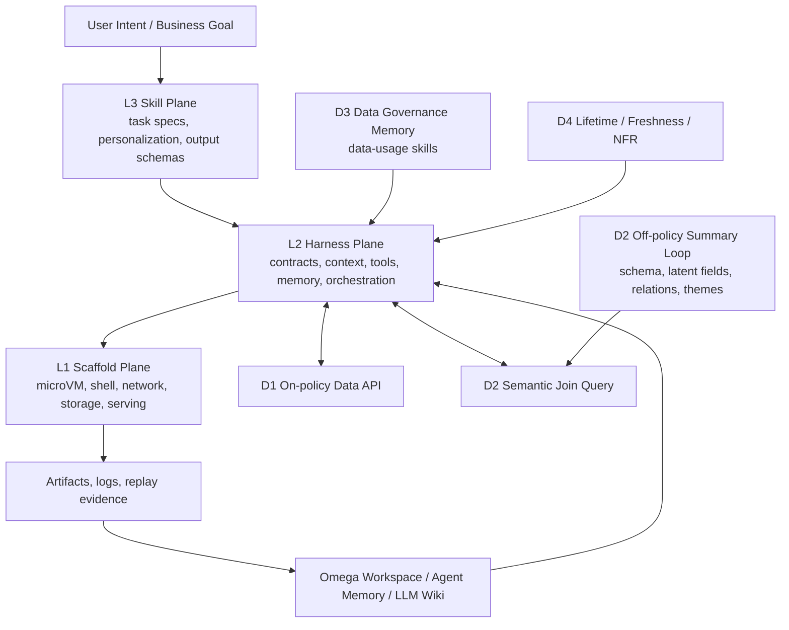
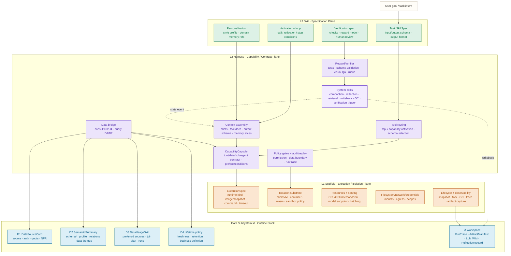
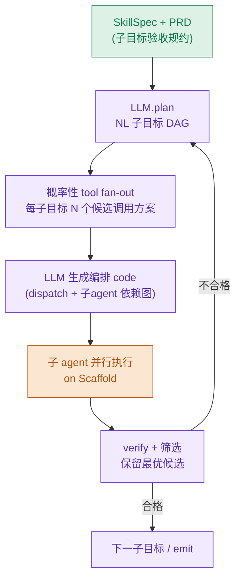

# 三层可扩展 Agentic Runtime：Scaffold、Harness、Skill 与外置数据子系统的参考架构

> **综合优化稿 v0.2** · 2026-06-28
> **合并来源**：①`~/Documents/deep research/three_layer_scalable_agentic_architecture_paper_draft.md`（YAML spec / RQ 结构 / 三张 mermaid 图 / 2026-06 HF 趋势论文）；②`agentic-scaling-architecture/notes/论文草稿-三层可扩展Agentic-Runtime.md`（四个最近邻区分表 / 编排原语 O1–O6 / 反方文献收敛）；③`site/architecture.html`（三张 SVG 图 + C1–C6 + N0–N5 + P1–P9）。
> **本稿作用**：作为单一事实源（single source of truth）。确认后，据本稿 §4.5 / §5.4 的 mermaid 去校准 `architecture.html` 的三张 SVG。

> **v0.2 相比两份原稿的增量（供 review）**
> 1. **新增"四个最近邻区分表"（§2.0）** —— novelty 防御核心：Anthropic Managed Agents、Inside-the-Scaffold、Five-Plane 命名、Pythia/SAGA/CacheSage 反方趋势。
> 2. **编排主张收敛（§5）** —— 回应 KAIJU/ActPlane/Verification Horizon："LLM 规划 + 概率性构造，loop 由可审计执行层管理"，而非"LLM 自由跑 loop"。
> 3. **编排八原语 O1–O8（§5.2 表）** —— 含 O7 模型选择、O8 token 分发；显式映射到 [[研究原则-外部记忆即Skill基础]] 九件套与 [[研究原则-情景记忆与WhatIf-HowAbout双引擎]] 正反例。
> 4. **逻辑扩展非免费（§2.3 + H1 证伪 + §10）** —— 纳入 Skill Shadowing(2605.24050)、Library Drift(2605.19576)。
> 5. **保留两稿全部 YAML spec 与三张图**，并在 spec 表里回填用户原话术语（microvm/bash/network/persistence/security；websearch/data search/pdf/multimodal/doc gen；文档解析/code 生成/git/报表；off-policy/LLM wiki/intermediate relation/data theme）。
> 6. **统一命题编号**：扩展轴 P1–P3、平面 P4–P6、数据 P7–P9 与 HTML 一致；H1–H9 作为面向实验的"假设语言"映射到 P 系列（§6 开头给映射）。
>
> **v0.3 增量（2026-06-28 第二轮）**
> 7. **新增 §4.6 业界已落地典型 spec** —— 对齐 Anthropic Agent Skills（SKILL.md 三级渐进披露 + 官方 pdf/docx/pptx/xlsx 等热门 skill）、MCP 六原语 + Tool annotations、Anthropic/OpenAI 工具定义、Claude Code 工具集、OpenAI Connectors/GPT Actions(OpenAPI)，并给出本架构对象→既有格式的投影表，指导工程实现与集成。
> 8. **Scaffold 新增企业 SSO/identity 与 cloud integration spec**（OIDC/SAML/SCIM/RBAC；AWS/GCP/Azure Workload Identity/KMS/对象存储/PrivateLink；ExecutionSpec 加 identity/cloud 段）。
> 9. **Harness 显式区分 code generation spec（Read/Edit/Bash + test/lint 闭环）与 tool synthesis**（代码→可复用工具 capsule）。
> 10. **编排原语扩为 O1–O8**：新增 **O7 模型选择**（按难度/成本路由 Opus/Sonnet/Haiku 级或 Bedrock/Vertex 端点）与 **O8 token 分发**（context 预算切分、KV 预留、背压），并写入 §5.3 agent loop 伪码。
>
> **v0.4 增量（2026-06-28 第三轮，吸收五篇新论文证据）**
> 11. **§4.4.1 D2 数据平面总结细化**：借 [[论文-Agent原生内存系统-2606.24775]] 四模块框架，把 D2 收紧为"**带时序约束的摘要文本 + 结构化 DB 存储**"——(S1) 条目化表示含 valid_from/valid_to/evidence_ref/supersedes；(S2) 结构化库索引加快检索 + 共享只读减少多 agent 对同一文献的争用；(S3) 时序检索靠逻辑失效（valid 区间）而非物理删除；(S4) 记忆溢出"降冷+留出处"而非硬删，防缺原文支持的幻觉。并据此收紧 P8、补 P7 与新测指标。
>
> **v0.5 增量（2026-07-03 第四轮，Code-as-Contract 内核）★**
> 12. **新增 §5.5「Harness = 以 code 为核心的编排内核」**：把抽象契约 `H:𝓘→𝓔` 的 𝓔 具体化为 **LLM 生成的编排代码**——plan(NL 子目标 DAG，PRD 控制) → 概率性 tool fan-out → 生成 code 派给子 agent → verify 筛选；子 agent 依赖靠 plan 生成的 code 控制。**由此化解 §5.1 的 KAIJU/ActPlane 张力：LLM 概率性地"写"代码、runtime 确定性地"跑"代码**。
> 13. **新增 §5.6「Skill = 结晶的 code-loop」**：reward-gated 的成功 loop 序列化为携带"工具调用+结果因果"的代码工件，跨用户/任务共享，`skill as integrated tool` 单次调用。
> 14. **新增 novelty N6（code-as-contract）、N7（skill 即结晶 code-loop）**；**新增 P10（S⊥H code-loop 松耦合/协同演化，可证伪）**；C5 解耦轴由 S⊥X 扩为 **S⊥X（逻辑⊥物理）+ S⊥H（经 code-loop 契约）双解耦**。
> 15. 正面回应 **SkillSmith(2606.01314)**：承认 skills/tools 协同演化，但**协同发生在 code-loop 接口内，层边界不破**（P10）。据此更新 §2.0 最近邻表、§7 实验（+7.7 code-loop 消融）、§8 novelty ledger、三张架构图。
>
> **v0.6 增量（2026-07-04 第五轮，Harness 工具八分类）**
> 16. **新增 §4.2.1「Harness 工具八分类」**：把 `CapabilityCapsule.implementation.kind` 规范为 **T1 标准工具 / T2 定制模型工具(model-as-tool) / T3 code 化可复用 skill(已结晶) / T4 数据主题查询(内+外部) / T5 自控 harness meta-tool(compact/recap) / T6 scaffold 能力(bash/file) / T7 human-in-the-loop(elicitation) / T8 LLM 即时生成的 code 工具(O5，未结晶)**。统一接口、分层治理；T2/T5 是相对原枚举真增量，T7=HITL 一等工具，**T8 补齐"即时生成工具"并给出 T8→T3 结晶生命周期**；**sub-agent 派生分解为 {Scaffold fork（启动/供算力 +X）| 内容=已有能力 或 T8 | N6 code-loop 调度}**（用户洞察：**启动 subagent 本身是 Scaffold 接口**，因占新 CPU；§4.1 新增 `subagent launch / fork` spec 行）。扩展 kind 枚举 + model_ref/served_on/lifecycle_of_tool 字段。
>
> **v0.7 增量（2026-07-04 第六轮，动态编排立场）**
> 17. **新增 §5.5.1「动态 LLM 编排，而非预设 workflow（vs dify/Manus）」**：明确 plan 是**运行期 LLM 依 NL 意图从工具库(T1–T8)动态选择+反思重组+按需造工具(T8)** 生成的编排代码，**不是设计期固定流程图 + 固定工具绑定**。四维区分表（plan 何时定 / 工具从哪来 / 组合方式 / 缺工具怎么办）；澄清与 §5.1 收敛不冲突（收敛的是"loop 谁推进"，本节是"plan 谁定"）。§2.0 加"预设 workflow（dify/n8n/Manus 模板）"最近邻区分行。

---

## 摘要

LLM agent 正从"带工具的聊天助手"演进为可持续执行复杂任务的数字员工。要进入稳定运营，核心挑战不只是提高单次推理能力，而是同时支持三类扩展：**逻辑扩展**（新增 task skill 与规约，扩大可完成任务集合 𝒯）、**物理扩展**（新增隔离运行环境、serving 容量、存储与网络，提升吞吐 Θ）、**数据扩展**（接入更多外部数据源并让 agent 正确理解、访问、治理）。现有 agent framework、tool-use benchmark、agent serving、memory system 与治理安全工作分别覆盖了部分机制，但缺少一个明确回答"逻辑扩展与物理扩展何时可以解耦"的参考架构。

本文提出三层 agentic runtime `A=⟨S,H,X⟩`：底层 **Scaffold** 负责物理执行与隔离，中层 **Harness** 负责能力契约、工具路由、上下文管理、系统维护与不变量执行，顶层 **Skill** 负责任务规约、个性化与输出格式。并引入与三层栈正交的外置数据子系统 `D=⟨D1,D2,D3,D4,Ω⟩`，作为离线 memory 与工作区。核心主张：**当 Skill 与 Scaffold 之间存在良定义 Harness 契约、且高频在线路径与低频控制/离线路径被分离时，agent 的逻辑可扩展性、物理可扩展性与数据可扩展性可以被分别度量与优化。** 我们特别强调**概率性控制面**：不同于传统系统由确定性配置驱动的控制面，agentic runtime 的工具选择、shot 构造、plan 生成、live coding、reflection 与 reward 选择部分由 LLM 参与，因此必须用 typed schema、审计日志、verifier、reward gate 与组合性不变量约束其不确定性。

本文给出三层及数据子系统的主要 spec、形式化命题（扩展轴 P1–P3、平面 P4–P6、数据 P7–P9）、LLM 驱动 orchestration 机制（八原语 O1–O8，含模型选择与 token 分发）、related work 对照（含必须区分的四个最近邻）与面向系统论文的实验设计。

**关键词**：LLM agents；agentic runtime；scaffold；harness；skill；逻辑/物理扩展解耦；probabilistic control plane；off-policy 数据总结；组合性安全。

---

## 1. 引言

### 1.1 三个问题

把 agent 当作数字员工，必须回答三个扩展问题：

- **逻辑扩展**：不断增加文档解析、代码生成、git 管理、数据报表、PDF 分析、网页检索、行业工作流等新能力。
- **物理扩展**：增加 microVM、容器、WASM sandbox、shell、网络、存储、模型 serving、KV cache、调度与安全隔离等底层资源。
- **数据扩展**：持续使用企业系统、第三方 SaaS、个人文件、公开互联网与历史 workspace 的数据；数据源增加时不能把所有 schema/文件/检索结果塞进 context，需离线 memory、语义摘要、data theme、intermediate relation 与数据使用经验。

三类扩展一旦耦合，出现四个病灶：①新增 skill 撑大 context、拖垮在线吞吐；②新增 sandbox 不提升真实任务覆盖；③新增数据源抬高单请求 token 成本；④治理逻辑散落于 prompt/工具/权限系统，难以审计复用。

### 1.2 主张（一句话）

> **我们证明 agent 的逻辑可扩展性与物理可扩展性可以解耦，解耦点是 Skills–Scaffold 之间的显式契约层（Harness）；给出该契约的形式化、组合性约束，并实验验证两个扩展维度的正交性；进一步把外部数据扩展纳入同一解释框架，并指出整个体系的编排内核是概率性（LLM 驱动）的。**

### 1.3 研究问题

- **RQ1**：逻辑扩展与物理扩展如何形式化定义，何时可视为正交？
- **RQ2**：Harness 需承担哪些契约、工具、记忆、治理、调度责任，才能使新增 Skill 不直接绑定 Scaffold？
- **RQ3**：外置数据子系统如何作为离线 memory 与工作区，避免数据源增长污染在线 context？
- **RQ4**：当 orchestration 由 LLM 驱动时，如何用 spec、verifier、reward 与审计机制约束概率性控制面？

### 1.4 贡献

1. 形式化三层 runtime `A=⟨S,H,X⟩`（Specification / Capability-Contract / Execution-Isolation Plane）。
2. 逻辑/物理扩展解耦命题（P1–P3）：新增 task skill 主要扩大 𝒯(A)，新增 Scaffold 实例主要提升 Θ(A)，解耦条件为 Skill 与 Scaffold 间存在显式 Harness 契约。
3. 控制面/数据面切分 + **概率性控制面（N0）**：数据面承载 token/tool/sandbox 执行；控制面承载 skill 选择、契约翻译、plan、memory trigger、policy 与不变量，且由 LLM 参与。
4. 外置数据子系统 `D=⟨D1,D2,D3,D4,Ω⟩`（off-policy 语义总结 + 数据治理即 skill）。
5. **概率性 LLM 编排内核**显式建模为架构第一公民（八原语 O1–O8：tool/shots/output/plan/live-coding/reflection/**模型选择**/**token 分发**），并给出与 serving/governance 反方工作的区分边界。
6. **Code-as-Contract 内核（N6，§5.5）**：把 Harness 契约 `H:𝓘→𝓔` 的 𝓔 物化为 LLM 生成的编排代码——**概率生成、确定执行**，化解"LLM 驱动 loop vs 确定性内核"张力。
7. **Skill 即结晶的 code-loop（N7，§5.6）** + **双解耦 S⊥X ∧ S⊥H（N8/P10，§5.7）**：成功 loop 经 reward-gate code 化为可跨用户共享的 integrated tool；Skill 与 Harness 经 code-loop 松耦合、分别迭代。
8. 每层主要 spec、可证伪 hypotheses（含 H10–H12/P10）、related work 对照、实验设计与开源系统蓝图。

---

## 2. 背景与相关工作

### 2.0 必须致敬并区分的四个最近邻（novelty 边界）★

> 这是本稿相对原始两稿新增、也是 reviewer 最先攻击的点。检索覆盖至 2026-06 中下旬。⚠️ = 题名核实、引用前须复核摘要。

| 工作 | 出处 | 与本架构的关系 | 本文 delta（必须站稳） |
|---|---|---|---|
| **Anthropic "Scaling Managed Agents: Decoupling the brain from the hands"** | anthropic.com/engineering, 2026-04 | ⚠️**最强威胁**：Session/Harness/Sandbox 三分 + "many stateless harnesses" ≈ brain/hands（逻辑/物理）解耦 | 它把编排/规划**捆进 brain**、未把 **Skills 立为独立逻辑扩展轴**、无**正交性命题**。本文 novelty = Skills-as-逻辑轴 + 可证伪正交判据 P1，而非 brain/hands 解耦本身 |
| **Inside the Scaffold: Source-Code Taxonomy of Coding Agent Architectures** | 2604.03515 | 已有三层 agent 分解（control / tool&env / resource）；其 **"scaffold"=整栈**，与本架构窄义 Scaffold 冲突 | 维度正交（它=描述性源码分类，本=扩展驱动）；**须显式声明命名冲突，论文正文统一用 Execution/Isolation Plane** |
| **A Five-Plane Reference Architecture for Runtime Governance** | 2606.12320 | 同为 "reference architecture"，独占 "five-plane governance" 措辞 | 互补不冲突：作为 C6 安全横切层嵌入；本文**不争用** five-plane 措辞，仅借其 "primitives+invariants+threats" 范式 |
| **Pythia / SAGA / CacheSage(Policy-Driven Runtime 2605.27744)** | 2604.25899 / 2605.00528 / 2605.27744 | ⚠️**反方证据**：serving 必须吃 workflow 结构才能优化（prefix-cache、workflow-atomic 调度） | 承认这是"性能层耦合"经验事实；界定**本架构解耦在契约/抽象层，非性能优化层**；正是 intent-scoped 加载让逻辑扩展不线性侵蚀 context |
| **SkillSmith: Co-Evolving Skills and Tools** | 2606.01314 | ⚠️**对 S⊥H 解耦的最强挑战**：主张 skills 与 tools 必须协同演化、反对固定工具层 | 本架构**承认协同演化，但约束在 code-loop 接口内**（§5.7）：Skill 经代码回流 Harness、Harness 以更好编排代码回馈 Skill，两侧不改对方内部 → **P10 可证伪** |
| **CodeAct / Anthropic "code execution with MCP"** | CodeAct 2402.01030 · anthropic.com/engineering 2026 | ✅**支撑 N6**：code 作 action space、用生成代码编排 MCP 工具省大量 token | 本架构 delta = 把它**定位为 Harness 契约的物化 + 概率/确定接缝**，非仅 prompting 技巧 |
| **预设 workflow（dify / n8n / Manus 模板等）** | 工业产品，非论文 | ⚠️**必须对立的反面**：设计期固定流程图 + 节点预绑定工具，运行期只解释执行 | 本架构 plan 是**运行期 LLM 从工具库动态选择+反思重组+按需造工具(T8)** 生成的编排代码（§5.5.1）——"主动式 agent" vs "预设 agent"；证伪见 H7 |

> **命名注意**：arXiv 上 "logical scalability"+"physical scalability" 配对 **0 命中** → 正交化 framing 是本文的。"Claw" 家族命名撞车：TokenPilot 的 Claw-Eval、Governed Shared Memory 的 MemClaw、本研究引用的 ClawVM —— 自创术语前须查重。

### 2.1 Agent runtime 与 serving layer

Policy-Driven Runtime Layer(2605.27744) 在 framework 与 serving engine 间插入 runtime layer（`observe/score/predict/act`），其 "seam" 论述直接支持"中间契约层必要"（→ P2 动机），但偏 serving 策略（缓存/批处理/调度）；本文 Harness 偏 **capability contract**（意图→可执行工具/数据/Scaffold 操作）。Helium(2603.16104) 把 LLM 调用当 query plan 一等 operator，workflow-aware scheduling → 物理扩展非简单堆机器。Autellix(2502.13965)、Pythia(2604.25899)、AGENTSERVESIM(2606.09613)、MORI(2606.00866) 提供 throughput/latency/TTFT/cache 指标，支撑物理扩展实验线，但通常不把"加能力"与"加吞吐"当两个正交变量。

### 2.2 Harness、tool synthesis 与大规模工具生态

Tool Forge(2605.28000) 的 tool capsule（intent + capability contract + implementation + tests + validation evidence + lifecycle + credentials + routing metadata）与 **intent-scoped routing（省 99.2% context）**，是本文 Harness capability capsule 的直接参照，也是 **P1 解耦可行性的关键工程证据**。PlanBench-XL(2606.22388，327 零售任务/1665 工具) 为 Harness 的 tool retrieval / route planning / dynamic adaptation 提供 benchmark。AOHP(2606.23449) 把 agent 作 OS-level actor，提供 OS-level harness → Harness 可下沉到 OS/workspace runtime。GUI vs. CLI(2606.24551) 显示 verifier-guided CLI skill augmentation 可显著提升成功率 → 支持"底层执行放 Scaffold、skill 覆盖与 verifier 引导放 Harness/Skill"。其它：Tool-Genesis(2603.05578)、AutoHarness(2603.03329)、MetaForge(2606.01801)、ToolLibGen(2510.07768)、Contract2Tool(2606.07904，"scalable contract layer" 措辞但 *tool* 粒度)。

### 2.3 Skill、workflow graph、skill 生命周期与组合风险

Agent Skills 综述(2605.07358)：skill = `(M,R,C)` 三元组，四阶段生命周期（表示/获取/检索/演化）。Skill-as-Pseudocode(2605.27955)、AIP(2606.04781，skill=带控制流节点执行图)、HASP(2605.17734)、VIGIL(2606.26524，skill 携 NL spec 运行时强制)、OPID(2606.26790，从 on-policy trajectory 蒸馏 hierarchical skill)。Dynamic Runtime Graphs(2603.22386) 的 template/realized-graph/trace 三分可映射 Skill 规约 / Harness 运行时组装 / Scaffold 执行记录，但其 "workflow scaffold" 与本架构 microVM 义冲突。Jagarin(2603.05069) 同名三层但维度正交。

⚠️**"逻辑扩展并非免费"（必答风险）**：**Skill Shadowing**(2605.24050，扩到 202 skill 性能掉 21%)、**Library Drift**(2605.19576，无界堆积劣化检索；LLM 自撰 skill +0.0pp vs 人工 +16.2pp)、**Benign in Isolation, Harmful in Composition**(2606.15242，组合攻击成功率 33.6%→96.5%) → 直接支撑 **P3**，并把"逻辑可扩展性"限定为**治理条件下**成立（见 §10）。

### 2.4 Agent memory 与 runtime state

Agent-Native Memory System?(2606.24775) 把 agent memory 当数据管理系统分解（存储/检索/更新/consolidation/lifecycle governance），指出现有评测过度依赖端到端成功率 → 与本文外置数据子系统方向一致。OpenRath(2606.19409) 的 session-centered runtime state（transcript/tool effects/memory events/workspace placement/branch provenance/replay）支撑本文 `RunTrace` 与 workspace provenance。MemSlides(2606.17162)：长时 profile memory + working memory + tool memory → 个性化 skill 需三类记忆。MemGUI-Agent(2606.19926)：把 context management 变成 agent action → 与本文将 compaction/writeback/reflection/retrieval 归 Harness system skill 一致。GateMem(2606.18829)：multi-principal shared memory 需同时评效用/访问控制/active forgetting → 数据 memory 与 workspace 须支持多主体权限、删除、遗忘。一手维护证据：**ClawVM**(2604.10352，compaction/writeback/校验定位 *harness layer*，"deterministic and auditable")；记忆演化综述(2605.06716)；Harness-1(2606.02373，state-externalizing + budget-aware context rendering)；TokenPilot(2606.17016，ingestion gate + lifecycle-aware eviction)。

### 2.5 数据访问、语义元数据与治理

Do Agents Need Semantic Metadata?(2605.28787)：预建语义元数据 precision 高 coverage 低，裸在线发现 coverage 高 precision 低（语义 agent 精度 +44.9~65.7%）→ 本文 **D2 off-policy 语义总结 loop 是第三条路径**（后台探索 + schema-on-read 摘要 + latent relation，在线仅 semantic-join 注入 top-k）。CoeusBI(2606.15384，百度 VLDB'26 离线语义视图 + schema linking)、UModel(2606.04799，阿里生产)、Semantic Layers(2604.25149，4KB 语义层文档 +17~23pt)、MCompassRAG(2606.18508，topic metadata 作 semantic compass)、DataClaw0(2606.21337，agentic data tailoring 作可迁移能力 → 支持 data-usage skill 为 Skill 第三类)。Governed Shared Memory(2606.24535，生产服务 "MemClaw"，"long-context retrieval alone is insufficient")。**空白**："schema-on-read" 在 2026 agent 文献无人采用；**off-policy 数据总结**最薄弱 → D2 novelty 空间最大。

### 2.6 评测、reward 与 verifier

EnterpriseClawBench(2606.23654)：企业 agent benchmark 须报告 harness-model 组合/artifact delivery/visual quality/cost/runtime/reproducibility → 印证"性能是 Skill+Harness+Scaffold+Data+模型的系统变量"。The Verification Horizon(2606.26300)：候选生成变易后**可靠验证成难点**，verifier 只是人类意图 proxy，受 reward hacking/signal saturation 影响 → 本文不把 reward gate 当万能，放在多信号+人工审计+回放证据机制中。OpenThoughts-Agent(2606.24855)、Qwen-AgentWorld(2606.24597)：未来 runtime 也生产训练数据/世界模型 → 本文 off-policy summary / run trace / data-usage skill 可作此类数据来源。⚠️**编排反方**：KAIJU(2604.02375，LLM 上游规划 + 确定性内核跑 loop)、ActPlane(2606.25189，enforcement 下沉 OS kernel) → 见 §5 主张收敛。

---

## 3. 架构定义

### 3.1 三层形式化

```text
A = <S, H, X>
```

- `S = {s1,...,sm}`：task Skill 集合（Specification Plane）。每个 skill 是规约对象 `s = ⟨desc, σ_in, σ_out, c_call, c_stop, c_loop, examples, prefs, verifier⟩`。维护类 system skill 归入 H 的维护子系统 M；数据使用经验沉淀于 D3。
- `H`：Harness（Capability-Contract Plane）。核心映射：

```text
H: Intent × State × CapabilityCatalog × DataContext -> ExecutionPlan
```

  内部三分 = **契约翻译 𝓘→𝓔 + 能力供给（内/外部工具 + tool synthesis）+ 维护子系统 M**（压缩/写回/反思/检索/GC），并做 path-aware 组合不变量执行与 audit。
- `X = {x1,...,xn}`：Scaffold 实例集合（Execution-Isolation Plane）。每个实例是隔离执行单元或 serving capacity unit，提供算力、shell、文件系统、网络、存储、凭证与安全边界。

**Skill 不直接依赖 Scaffold；Scaffold 不理解 task skill 业务语义。二者依赖全经由 Harness 的 typed contract。**

度量：`𝒯(A)`=能力覆盖、`Θ(A)`=吞吐、`ℓ(A)`=单请求成本。

### 3.2 外置数据子系统

```text
D = <D1, D2, D3, D4, Omega>
```

- `D1` on-policy 取数 API：`q=⟨src,scope,time,proj⟩ → R(q)`。
- `D2` off-policy 语义总结 loop（栈外独立异步子系统 𝓛₂）：自带 loop/sub-agents/模型，schema-on-read 预总结进不截断 lake（schema*、content profile、latent fields、relations、**data theme**），仅 semantic-join 查询接口进主路径。
- `D3` 数据治理 memory：把"如何用数据"沉淀为 per-use-case **data-usage skill**（含 **intermediate relation**：跨源中间关系）。治理从"管边界"升级为"沉淀经验"。
- `D4` lifetime 体系：时新性 + 业务口径（有时效的定义）+ 访问 NFR 预算（防空访问与阻塞）。
- `Ω` agent 自有 memory/workspace：RunTrace、ArtifactManifest、IntermediateRelation、**LLM Wiki**、branch provenance、ReflectionRecord。

**D 不是第四层**：不在 S→H→X 垂直调用链上。在线侧 D1/D2 的 semantic-join 接口 ⊆ Interface(H)（Harness 直接调用）；离线侧 D2 生产 loop 𝓛₂ **在栈外、不被 H 调度**；D3/D4 为独立 API 供 context 组装查询。契约映射扩展：`H: 𝓘 —consult D3,D4→ plan —D1,D2→ 𝓔`。

### 3.3 控制面 / 数据面

| 层 | 数据面 DP（∝ token/执行流量） | 控制面 CP（∝ 状态事件/决策复杂度） |
|---|---|---|
| Skill | 激活 skill 的 context tokens、few-shot、输出 token | skill 选择、调用/终止/循环条件、输出格式 |
| Harness | 工具执行、检索、PDF、代码执行、M 维护推理 token | 契约翻译、路由、context assembly、M 触发、policy、reward gate |
| Scaffold | sandbox 执行、进程、I/O、serving 前向、KV cache | 实例调度、网络策略、凭证分配、隔离边界、资源预算 |
| Data | D1 取数、D2 查询接口、workspace artifact 读写 | D2 off-policy loop、D3 data-usage skill、D4 lifetime policy |

**N0 概率性控制面**：控制策略不由确定性配置写死，而由 LLM 依 architecture state / information state / tool contract / memory / reward signal 动态生成 → 需 typed schema、invariant gate、可审计 trace、verifier 约束。这是平面切分的真正贡献点（而非套用 SDN/K8s）。

### 3.4 架构总图（→ 对应 HTML 图1）



---

## 4. Layer Specs

> spec 不是代码实现，而是 runtime 可扩展、可调度、可审计、可验证的最小契约。每条已回填用户原话术语。

### 4.1 Scaffold Layer：物理扩展 spec

| Spec | 主要内容（含用户原话） | 关键指标 | 面 |
|---|---|---|---|
| **isolation substrate (microvm)** | microVM、container、WASM sandbox、OS process、mobile OS actor | escape rate、cold start、snapshot restore | DP |
| **bash / process** | shell、命令执行、进程树、stdin/out/err、退出码 | command success、timeout、side-effect trace | DP |
| filesystem / workspace | mount、cwd、artifact manifest、临时文件、ro/rw | reproducibility、artifact completeness | DP |
| **persistence storage** | object store、DB、workspace volume、memory store、cache | durability、读写延迟、quota | DP |
| **network** | allowlist/denylist、egress policy、DNS、proxy、rate limit | blocked violation、latency、egress cost | CP+DP |
| credentials / IAM | secret injection、least privilege、capability attenuation、rotation | secret exposure、privilege escalation | CP |
| **enterprise SSO / identity** | OIDC / SAML 2.0 联合登录、SCIM 用户/组同步、RBAC/ABAC、租户隔离、JIT 授权、审计登录事件 | SSO 成功率、token 刷新失败、越权访问、合规审计完整性 | CP |
| **cloud integration** | AWS/GCP/Azure 接入；IAM Role / Workload Identity（免静态密钥）、KMS/Secrets Manager、对象存储（S3/GCS/Blob）、VPC/PrivateLink、Bedrock/Vertex 模型端点 | 跨云延迟、密钥泄漏面、egress cost、provider 故障切换 | CP+DP |
| **security policy** | syscall filter、path/network policy、malware scan、prompt/tool boundary | policy violation、audit completeness | CP |
| serving capacity | model endpoint、KV cache、batching、speculative decoding、多租户调度 | TTFT、tokens/s、throughput、cost | DP |
| lifecycle | create/pause/resume/snapshot/fork/merge/terminate/GC | recovery time、orphan resource | CP |
| **subagent launch / fork** | **启动/供给一个 subagent 运行时**：分配 CPU/隔离单元/serving 槽位并 fork 出可调度执行体（=物理扩展 +X；内容跑什么与本接口正交，见 §4.2.1 #3） | subagent 冷启动、资源占用、并发上限 | DP |
| observability | trace id、tool log、resource usage、placement、replay evidence | replay success、trace coverage | CP |
| concurrency | worker pool、queue、backpressure、priority、preemption | p95 latency、saturation point | CP |

```yaml
ExecutionSpec:
  scaffold_id: string
  runtime_kind: microvm | container | wasm | process | mobile_os_actor
  image_or_snapshot: string
  command: { argv: [string], cwd: string, env: map, timeout_ms: integer }
  resources: { cpu: string, memory_mb: integer, disk_mb: integer, gpu: optional }
  filesystem: { mounts: [{ source: string, target: string, mode: ro|rw }] }
  network_policy: { egress: deny_all|allowlist|unrestricted, allowlist: [string] }
  credentials: { scopes: [string], injection: env|file|broker }
  identity:                                        # enterprise SSO / 多租户
    tenant_id: string
    principal: { sub: string, roles: [string], groups: [string] }
    sso: { protocol: oidc|saml2, idp: string, token_ref: string }
  cloud:                                           # 云集成（免静态密钥）
    provider: aws|gcp|azure|none
    workload_identity_ref: string                  # IAM Role / Workload Identity Federation
    kms_key_ref: optional
    object_store: { kind: s3|gcs|blob, bucket: string }
    private_network: { vpc: optional, endpoint: optional }
  observability: { trace_id: string, capture_stdout: boolean, capture_artifacts: boolean }
  security: { syscall_profile: string, data_boundary: string }
```

扩展操作 = 新增/替换 `ExecutionSpec` 可调度到的实例（microVM 池、serving pool、GPU/browser worker、storage shard），**理想情况下不需修改 Skill spec**。

### 4.2 Harness Layer：能力契约与逻辑扩展 spec

| Spec | 主要内容（含用户原话） | 面 |
|---|---|---|
| capability registry | 工具、数据接口、sub-agent、Scaffold 能力、模型能力 | CP |
| **能力供给** | **web search · data search · PDF analysis · multimodal perception · doc generation** | DP |
| tool routing | intent matching、tool retrieval、schema selection、top-k 激活（避免全量 schema 进 context） | CP |
| context assembly | task state、memory、shots、tool docs、data summary、output format | DP+CP |
| memory maintenance (M) | compaction、writeback、retrieval、reflection、forgetting、GC（system skill，状态事件触发） | CP 触发/DP 推理 |
| **code generation** | 面向交付物的代码生成：Read/Grep/Glob 检索 → Edit/Write 改写 → Bash 跑测试/lint → diff/patch → 迭代修复（对标 Claude Code Read/Edit/Bash + SWE-agent ACI）；产物是**代码 artifact**（不一定注册为工具） | DP+CP |
| **tool synthesis (live coding)** | 当缺少能力时**把代码升级为可复用工具**：tool generation、sandbox test、validation evidence → 注册为 capsule（对标 Tool Forge capsule） | CP→DP |
| data bridge | D1 查询、D2 semantic join、D3/D4 context 查询 | DP+CP |
| policy gates | permission check、auth isolation、capability attenuation、data boundary | CP |
| reward / verifier | tests、schema validation、visual QA、semantic rubric、human proxy | CP |
| audit / replay | run trace、tool evidence、branch provenance、decision log（N0 可审计） | CP |

```yaml
CapabilityCapsule:
  capability_id: string
  intent: { description: string, embeddings: optional, trigger_examples: [string] }
  contract: { input_schema: object, output_schema: object, preconditions: [string], postconditions: [string], invariants: [string] }
  implementation:                                  # kind = §4.2.1 工具八分类
    kind: standard_tool                            # T1 标准工具 (web_search…)
        | model_tool                               # T2 定制模型工具 (微调 OCR 小模型…)
        | crystallized_skill                       # T3 code 化可复用 skill (N7，已结晶)
        | data_theme_query                         # T4 数据主题查询 (内/外部 D1/D2)
        | harness_meta_tool                        # T5 自控 harness (compact/recap…)
        | scaffold_command                         # T6 scaffold 能力 (bash/file…)
        | elicitation                              # T7 human-in-the-loop (MCP Elicitation)
        | ephemeral_code_tool                      # T8 LLM 即时生成的 code 工具 (O5 live coding，未结晶)
    execution_spec_ref: string
    model_ref: optional                            # T2：模型端点/权重引用
    served_on: optional                            # T2/T6：Scaffold serving/实例
    lifecycle_of_tool: optional                    # T8→T3：ephemeral | reward_gated | crystallized
  validation: { tests: [string], verifier: string, confidence: number }
  lifecycle: { version: string, owner: string, status: experimental|stable|deprecated }
  security: { required_scopes: [string], data_boundary: string, network_policy: string }
  routing: { tags: [string], cost_hint: number, latency_hint_ms: integer }
```

**按需激活原则**：大规模工具生态下 context 不应含全部 tool schema；Harness 按当前意图/状态/data theme 选少量 capsule，构造 shots 与 output schema（→ 缓解 P1 风险）。

#### 4.2.1 Harness 工具八分类（tool taxonomy）★

> 用户洞察（2026-07-04）：Harness 的"tools"并非同质，可按**实现载体 + 作用对象**分为若干类。本节把它规范为**统一 `CapabilityCapsule` 接口下的 8 个 `implementation.kind`**——无论哪一类，对 LLM 编排都呈现同一份 `intent + contract`（§4.2），差异只在实现与治理侧。这既回答"Harness 不只是提供 tools"（§5.5 code-as-contract），也给 O1 tool 选择一个明确的类型学。

| # | 类型 | `kind` | 是什么 / 例子 | 文献锚点 | 治理要点（spec 侧重） |
|---|---|---|---|---|---|
| **T1** | 标准工具 | `standard_tool` | 通用确定性能力：web search、web fetch、calculator、code_execution | MCP Tools；Anthropic `web_search`/`code_execution` | 幂等/只读提示（`annotations`）、rate limit、egress |
| **T2** | **定制模型工具** | `model_tool` | 以**模型**为实现的工具：微调 OCR 小模型、领域分类器、embedding 模型、rerank 模型 | HuggingGPT（调专门模型）、Toolformer；本架构 **O7 model routing** | `model_ref` + `served_on`（Scaffold serving）、版本/漂移监控、置信度阈值、fallback 到大模型 |
| **T3** | code 化可复用 skill | `crystallized_skill` | LLM 制造、经**语义 skill 层验证、行为可期**的定制工具 = **N7 结晶 code-loop** | CodeAct、Voyager、Tool Forge（validation-carrying） | `causal_trace` + `generalization.tested_contexts`、reward-gate、sandbox 验证证据 |
| **T4** | 数据主题查询 | `data_theme_query` | 对**数据主题**取数：外部（天眼查/GitHub/arXiv）+ 内部（人员名录、组织结构、quota、territory 划分） | MCP Resources、text-to-SQL、CoeusBI/UModel；本架构 **D1/D2 bridge** | data_boundary、行/列级权限、口径版本（D4）、内外部分级、脱敏 |
| **T5** | **自控 harness 的 meta-tool** | `harness_meta_tool` | LLM **可显式调用**的运行时自管理：compact、recap、writeback、retrieve-memory、fork/branch | Anthropic Memory tool、MemGUI-Agent（"context mgmt as agent action"）、ClawVM | 只作用于自身 context/memory、不出隔离边界、全程 audit（N0） |
| **T6** | scaffold 能力工具 | `scaffold_command` | 直达底层执行：bash、file(Read/Write/Edit)、process、network 原语 | Claude Code Bash/Read/Write、Anthropic `bash`/text-editor tool | 权限分级（读<写<执行）、syscall/path/network policy、fail-closed |
| **T7** | **human-in-the-loop 工具** | `elicitation` | 把**人**当作运行时可调用的能力单元：运行中向人追问 / 澄清 / 确认 / 审批 / 打分（human-in-the-loop） | MCP **Elicitation** 原语、`AskUserQuestion`；HITL 文献（active learning / 人在环审批） | 用户控制、结构化 schema、审批留痕、超时与拒答兜底；企业 KYC/风控/审批场景必备。**注：人给的确认结果又是 T3 结晶 skill 的正例来源（见 §5.6 "human-in-the-loop 是 skill 生成器"）** |
| **T8** | **LLM 即时生成的 code 工具** | `ephemeral_code_tool` | skill 在 plan 时提出工具需求，Harness 调 LLM **当场生成一段程序**作为工具执行（尚未复用/未结晶）= **O5 live coding 的产物** | CodeAct（code 即 action）、Voyager（迭代造技能）；本架构 **O5 / §5.5** | sandbox 隔离执行、`lifecycle_of_tool: ephemeral`、必须经 verify；**通过 reward-gate + 跨 context 泛化测试后 → 结晶为 T3**（`ephemeral → reward_gated → crystallized`） |

**三条设计说明（写进论文）：**
1. **统一接口、分层治理**：七类共用 §4.2 的 `CapabilityCapsule`，对 LLM 只暴露 `intent + I/O 契约`；类型差异体现在 `implementation.kind` 与各自的 `security/validation/lifecycle` 侧重（如 T2 要 model 漂移监控、T4 要行列权限、T5 不得越隔离边界）。→ 这是 **P2 契约充分性**的类型学落地。
2. **T2 与 T5 是相对现有枚举的两处真增量**：**model-as-tool（T2）** 把"微调小模型"纳入工具生态（区别于 O7 只是"给主 LLM 选型"——T2 是把模型当被调用的能力单元）；**meta-tool（T5）** 把维护子系统 M 从"仅状态事件触发的后台"升级为"**LLM 可主动调用的运行时自控能力**"（与 MemGUI-Agent 的"context 管理即 action"一致），但仍受 N0 审计与隔离约束。
3. **sub-agent 派生不是"第 N 类工具"，而是一个跨层动作，按"资源 / 内容 / 接线"三问分解（用户洞察 2026-07-04）**：
   - **"在哪里、用什么资源跑" = Scaffold 接口**：**启动一个 subagent 这个动作本身就是 Scaffold 提供的接口**——因为它要分配新的 CPU / 隔离执行单元 / serving 槽位（对应 §4.1 Scaffold `lifecycle: fork` + `resources`）。这是**物理扩展（+X）**，无论 subagent 里跑什么。
   - **"跑什么" = 已有能力 或 T8**：subagent 内执行的可能是**已有 tools**（复用现成能力，不新增工具类型），也可能是 skill 提出需求、Harness 调 LLM **现编的程序 → T8**（`ephemeral_code_tool`）。
   - **"谁调谁、按什么顺序" = N6 code-loop**：派发与依赖接线由 plan 生成的**编排代码（N6）**表达。
   → 因此"派生 subagent"被分解为 {**Scaffold fork（启动/供给算力，+X）** | 内容=已有能力 或 T8 生成工具 | N6 code-loop 调度}，而非新增一个工具类型。**关键更正**：占资源、把 subagent"跑起来"的那一步归 Scaffold（物理轴），与"跑什么内容"正交。

4. **T8 → T3 的工具生命周期**：T8 是**即时、单次、未复用**的生成工具（O5 产物）；一旦经 verify + reward-gate + 跨 context 泛化测试，它**结晶**为 T3（`crystallized_skill`，N7），获得可复用/可共享/as-integrated-tool 的地位。`lifecycle_of_tool: ephemeral → reward_gated → crystallized` 显式刻画这条升迁路径。这也把原来 T3 混在一起的"即时生成"与"已结晶复用"两个阶段拆清。
5. **T7 = human-in-the-loop 的工具化**：把"向人追问/确认/审批"建模为一个**可被 O1 选择、可被 plan 调用的工具**（而非架构外的旁路）。意义有二：①企业场景（KYC、风控、合规审批）里"人"是不可省的能力节点，必须在契约与审计内表达；②**人的确认结果闭环回 T3**——每次 human 确认把"不确定输出"变成"确定正例"，正是 §5.6 与 [[研究原则-外部记忆即Skill基础]]"human-in-the-loop 是 skill 生成器"的落点。故 T7 不只是 UI，而是 skill 结晶的**数据来源**。

> **与 O1（tool 选择）的接口**：O1 在这七类的联合目录上做 intent-scoped 检索与 top-k 激活；`routing.tags` 应标注 `kind` 便于按类型过滤（如"本步只允许只读 T1/T4"）。

### 4.3 Skill Layer：个性化与任务规约 spec

> **skill 三分**：task skill（L3，面向用户）/ system skill（L2 Harness 维护子系统）/ data-usage skill（D3，Harness 按需调用）。

| Spec 类型 | 示例（含用户原话） | 输出直接面向用户 | 归属 |
|---|---|---|---|
| **task skill** | **文档解析 · code 生成 · git 管理 · 数据报表生成** · 研究综述 · PPT 生成 | 是 | L3 Skill 层 |
| system skill | memory compaction · reflection · retrieval · writeback · GC · verification trigger | 否 | L2 Harness 维护子系统 M |
| data-usage skill | 某 use case 下数据源选择 · join 关系 · top-k 权重 · 刷新策略 | 间接 | 数据子系统 D3 |

```yaml
SkillSpec:
  skill_id: string; name: string; description: string; domain: string
  input_schema: object; output_schema: object
  output_format: { type: markdown|json|docx|xlsx|code_patch|report, constraints: [string] }
  activation: { call_conditions: [string], required_capabilities: [string], required_data_themes: [string] }
  loop: { max_steps: integer, reflection_conditions: [string], stop_conditions: [string] }
  personalization: { user_preferences: [string], style_profile_ref: optional, domain_memory_ref: optional }
  examples: { shots: [string], anti_examples: [string] }
  verification: { checks: [string], reward_model: optional, human_review_required: boolean }
  versioning: { version: string, changelog: string }
```

| 用户列举的 Skill | 关键 spec | Harness 依赖 | Data 依赖 |
|---|---|---|---|
| 文档解析 | 文件类型、抽取范围、引用格式、表格/图像策略 | PDF analysis、OCR、layout parser | workspace artifacts、LLM wiki |
| Code 生成 | repo 边界、测试命令、风格、patch 约束、回滚 | shell、editor、test verifier、git | run trace、error memory |
| Git 管理 | branch、diff、commit policy、PR rubric、冲突 | git CLI、review harness、audit | repo provenance |
| 数据报表生成 | 指标口径、时间范围、图表类型、交付格式 | data search、spreadsheet、doc generation | D1/D2/D3/D4 |
| 研究综述 | source policy、检索范围、引用格式、novelty ledger | web search、PDF、note reading | LLM wiki、paper graph |
| 个性化写作 | 语气、结构偏好、术语表、禁用表达 | memory retrieval、style verifier | user profile memory |

逻辑扩展 = 把 SkillSpec **注册到 Harness 按 intent 激活**，而非把更多文本永久放进 system prompt——否则新增 Skill 通过 context 膨胀污染数据面，破坏逻辑/物理解耦。

### 4.4 Data Subsystem：离线 memory 与工作区 spec

| 组件 | Spec（含用户原话） | 作用 |
|---|---|---|
| D1 data access | source、scope、time、projection、auth、quota、latency | 当前任务按需取数 |
| **D2 semantic summary** | **带时序约束的摘要条目**（claim + valid_from/valid_to + evidence_ref + supersedes）存入**结构化 DB**；schema*、relations、**data themes** | 离线总结、共享只读、时点检索；逻辑失效不硬删（详见 §4.4.1） |
| **D3 governance memory** | use case、data path、top-k 权重、成败、替代源、风险（**intermediate relation**） | 沉淀 data-usage skill |
| D4 lifetime | freshness、业务口径、validity、NFR budget、retention | 控制时效与访问成本 |
| **Ω workspace** | artifacts、run trace、intermediate relation、**LLM wiki**、branch provenance | agent 自有记忆与工作区 |

```yaml
SemanticSummary:
  source_id: string
  schema_star: { fields: [string], inferred_types: map }
  content_profile: { time_range: string, entity_coverage: [string], sparsity: string }
  latent_fields: [{ name: string, evidence: string, confidence: number }]
  relations: [{ source_field: string, target_source: string, target_field: string, relation_type: semantic_join|hierarchy|temporal|causal_hint, confidence: number }]
  data_themes: [string]; summary_version: string
```

D2 off-policy loop：`observe(source changes) → search(structure/content/latent) → summarize(schema*,profile,relations,themes) → verify(quality/freshness) → write(off-policy lake) → expose semantic_join(intent, top_k)`。

#### 4.4.1 D2 细化：带时序约束的结构化摘要存储（refined）

> 借鉴 [[论文-Agent原生内存系统-2606.24775]] 的"内存即数据管理系统"四模块框架（表示/提取/检索路由/维护），把 D2 的"off-policy 总结"从一个模糊的 lake 收紧为一个**有明确表示与维护语义的结构化存储**。核心设计：**总结的输出是带时序约束的文本，落入结构化数据库（而非裸向量堆或纯文本追加）**。

**S1 · 表示（Representation）—— 总结输出 = 带时序约束的文本条目。**
D2 的产物不是无状态的嵌入，而是**条目化的摘要文本**，每条携带显式时序与出处元数据：

```yaml
SummaryEntry:                      # D2 写入结构化 DB 的最小单元
  entry_id: string
  source_id: string                # 来自哪个数据源
  claim: string                    # 带时序约束的摘要文本（自然语言，含"截至 T 有效"）
  valid_from: datetime             # 时序约束：生效时点
  valid_to: datetime | null        # 失效时点；null=当前有效（逻辑失效用，非物理删除）
  evidence_ref: [string]           # 指回原文 span / 文件偏移（防"缺原文支持的幻觉"）
  supersedes: [entry_id]           # 被本条取代的旧条目（逻辑链，不删旧条）
  themes: [string]; confidence: number; summary_version: string
```

→ 与四模块对应：**表示**=结构化条目 + 时序字段；**提取**=受限模式（schema-on-read，进 DB 前结构化）；**检索路由**=DB 索引 + 时点过滤；**维护**=逻辑失效（见 S4），而非容量驱逐。

**S2 · 结构化数据库存储（不是向量堆 / 不是文本追加）。**
摘要条目落入**带索引的结构化库**（关系/文档 + 可选向量列做语义召回）。带来三重收益：
1. **加快检索**：`source_id / themes / valid_from..valid_to` 上建索引，时点查询 = 一次带 `WHERE valid_at(T)` 的索引扫描，远快于全量向量重排；semantic-join 只在候选集上做。
2. **减少多 agent 对同一文献的争用**：摘要**写一次、多 agent 共享读**（读多写少 + MVCC 快照读），取代"每个 agent 各自把同一篇 PDF 拉进自己 context 重新消化"——这正是 [[论文-AOHP操作系统级智能体线束-2606.23449]] 把跨应用数据流转上移到 OS 层、以及 [[论文-Agent原生内存系统-2606.24775]] "fleet-memory / 共享治理记忆"要解决的争用问题；对应 token 成本与重复推理的大幅下降（AOHP 实测 token −51.55% 的同类机理）。

**S3 · 时序检索靠"逻辑失效"，不靠物理删除。**
回答"截至某时点 T 的事实"= 查 `valid_from ≤ T < valid_to`（或 `valid_to is null`）。事实被修订时**不覆盖旧条**，而是：新条 `valid_from=T'`、旧条 `valid_to=T'` 并记 `supersedes`。于是：
- **支持时序检索**：既能取"现在"，也能取"历史某时点"的视图（多版本，回应 [[论文-Agent原生内存系统-2606.24775]] RQ4"裸长上下文在时间查询上反胜"的短板——因为标准语义整合破坏时序线索，这里用**显式 valid 区间保住时序**）。
- **防"过去的幻觉"**：旧事实被逻辑失效而非残留，避免陈旧条目被错误召回（对应 RQ3 update robustness）。

**S4 · 记忆溢出时"逻辑失效 + 降冷"，不"硬删"——防缺原文支持的幻觉。**
容量到限时，**不物理删除条目内容**，而是分级降冷：①热层（DB 全文+索引）→ ②冷层（仅保留 `claim + evidence_ref + valid 区间`，剔除附属 profile）→ ③归档（仅 `evidence_ref` 指针）。关键不变量：

> **任何仍可被召回的摘要，必须保留可回指原文的 `evidence_ref`。** 一旦某条只剩"结论"却丢了原文出处，它要么被标记 `unverifiable` 不得作为事实注入 context，要么触发 D2 从原源重新取证。

→ 这把内存溢出从"硬删导致悬空结论 → 幻觉"改造为"降冷但留出处 → 可重新验证"，正面回应"记忆溢出被硬删 + 缺原文支持 → 不必要幻觉"。

**与命题/实验的接口（强化建议 2）。**
- **P8（语义摘要充分性）收紧**：D2 的充分性以**保时序 + 保出处**为前提，否则被裸长上下文打败（RQ4 反例）。实验对照 4 路：(a) 在线发现 / (b) 人工元数据 / (c) 朴素 off-policy 摘要 / **(d) 本节带时序约束的结构化摘要**——预期 (d) 在 last-mile success 与时点查询上同时优于 (a)(b)(c)。
- **P7（取数解耦）**：共享只读摘要 + DB 索引使"加数据源不抬高单请求 token 成本"更易成立（争用与重复消化被消除）。
- **新增可测指标**：多 agent 并发下的**争用率 / 重复消化 token**、时点查询延迟、`unverifiable` 率、逻辑失效后陈旧召回率。

```yaml
DataUsageSkill:
  usecase_id: string; intent_pattern: string; preferred_sources: [string]
  semantic_join_plan: { top_k: integer, weights: map, fallback_sources: [string] }
  access_plan: { query_templates: [string], freshness_requirements: string, nfr_budget: string }
  evidence: { successful_runs: [string], failed_runs: [string], verifier_scores: [number] }
  governance: { allowed_roles: [string], forbidden_joins: [string], deletion_policy: string }
```

`Ω` 最小对象：**RunTrace**（用户目标/激活 Skill/Harness 决策/工具调用/Scaffold placement/数据访问/verifier 分/artifact）、**IntermediateRelation**、**LLM Wiki**（稳定知识/术语/业务口径/项目约定/用户偏好）、**ArtifactManifest**、**ReflectionRecord**。

### 4.5 Spec 架构图（→ 对应 HTML 图2）

> 关键修正：**System skill 位于 Harness 维护子系统，不在 L3**；L3 只承载 task 规约与用户可感知逻辑扩展。



### 4.6 业界已落地的典型 spec（指导工程实现与集成）

> 本节不再严格按用户原话造字段，而是**对齐 Anthropic / OpenAI 官方与 MCP 生态中最常见、最受欢迎的真实 spec**，作为本架构三类对象（Skill / Capability / 数据接口）的工程蓝图。本架构的抽象对象（SkillSpec / CapabilityCapsule / ExecutionSpec / DataUsageSkill）应能**无损投影**到这些既有格式，从而保证可集成性。字段大小写为各家官方原样（须区分：MCP=camelCase、Anthropic API=snake_case、SKILL.md=hyphen-case）。

#### 4.6.1 Skill 层 ← Anthropic Agent Skills（SKILL.md 开放标准）

skill = 目录（目录名 = `name`）含 `SKILL.md`（YAML frontmatter + Markdown 正文）+ 可选 `scripts/` `references/` `assets/`。**渐进式披露三级**：L1 元数据（`name`+`description`，始终注入，~100 tokens/skill）→ L2 正文（触发时读入，建议 <5k tokens）→ L3 资源/脚本（按需，脚本经 bash 执行**仅输出进 context**）。

| frontmatter 字段 | 必填 | 约束（官方） | 映射到本架构 SkillSpec |
|---|---|---|---|
| `name` | 是 | 1–64 字符，lowercase `a-z0-9-`，须 = 目录名，禁含 "anthropic"/"claude" | `skill_id` / `name` |
| `description` | 是 | 1–1024 字符，第三人称，写明**做什么 + 何时用**（注入 system prompt） | `description` + `activation.call_conditions` |
| `allowed-tools` | 否 | 空格分隔的预批准工具（实验性），如 `Bash(git:*) Read` | `activation.required_capabilities` + 权限边界 |
| `metadata` | 否 | string→string（`version`/`author` 作为嵌套键；**标准无顶层 version**） | `versioning` |
| `license` / `compatibility` | 否 | 许可 / 环境要求 | lifecycle |

**官方最受欢迎的 skill（`anthropics/skills` 仓库）**：四大文档技能 `pdf`（抽取/合并/拆分/表单/OCR）、`docx`（TOC/批注/tracked changes，用 pandoc）、`pptx`（模板/讲者备注/QA）、`xlsx`（偏好活公式而非硬编码值）；以及 `skill-creator`、`mcp-builder`、`claude-api`、`frontend-design`、`webapp-testing`、`web-artifacts-builder` 等。
→ **工程含义**：本架构 §4.3 列举的"文档解析 / code 生成 / git 管理 / 数据报表"task skill，应直接采用 SKILL.md 格式与渐进式披露三级；逻辑扩展 = 往 skill 目录加 SKILL.md，与 P1"按需加载"天然契合（L1 元数据常驻、L2/L3 触发才读）。

#### 4.6.2 Capability/Harness 层 ← MCP 原语 + Anthropic/OpenAI 工具定义

**MCP（协议版本 2025-06-18，JSON-RPC 2.0）三大 server 原语 + 三大 client 原语**：

| 原语 | 由谁暴露 | 控制模型 | 映射 |
|---|---|---|---|
| **Tools** | server | 模型控制 | CapabilityCapsule（可执行） |
| **Resources**（URI 标识的 context 数据） | server | 应用控制 | 数据接口 / D1 取数 |
| **Prompts**（带参模板） | server | 用户控制 | shots / 模板 skill |
| **Sampling**（server 反向请求 client 补全） | client | server 发起 | sub-agent 调用 |
| **Roots**（文件系统边界） | client | 客户端控制 | Scaffold filesystem 边界 |
| **Elicitation**（运行中结构化追问，2025-06-18 新增） | client | 用户控制 | AskUserQuestion / human-in-the-loop |

**MCP Tool 定义 schema**（camelCase）：`name`（必）、`title`、`description`、`inputSchema`（必，JSON Schema）、`outputSchema`、`annotations`。**`annotations` 行为提示**（默认值取自规范 schema.ts，非散文档）：`readOnlyHint=false`、`destructiveHint=true`、`idempotentHint=false`、`openWorldHint=true`——客户端 **MUST** 视为不可信除非 server 可信。传输：**stdio**（子进程）与 **Streamable HTTP**（2025-03-26 引入，取代旧 HTTP+SSE）。

**最受欢迎的 MCP server**（`modelcontextprotocol/servers`，当前参考实现）：`fetch`（网页→markdown）、`filesystem`（带访问控制的文件操作）、`git`（读/搜/改仓库）、`memory`（知识图谱持久记忆）、`sequentialthinking`、`time`、`everything`（测试参考）；历史上常用、现归档/转厂商维护：`github`、`postgres`、`sqlite`、`slack`、`puppeteer`、`brave-search`、`gdrive`。

**Anthropic API 工具定义**（snake_case）：`{name, description, input_schema}` + 可选 `strict`、`cache_control`；`tool_choice ∈ {auto, any, tool, none}`。**官方 server/built-in 工具**（canonical `type`→`name`）：`web_search`、`web_fetch`、`code_execution`、`bash`（`bash_20250124`）、`str_replace_based_edit_tool`（text editor）、`memory`、`computer`。

**OpenAI 工具定义**：Responses API 扁平 `{type:"function", name, description, parameters, strict}`；Chat Completions 把后四者嵌在 `function` 下。**built-in/hosted 工具**：`web_search`、`file_search`（`vector_store_ids`）、`code_interpreter`（`container`）、`image_generation`、`computer`、`mcp`（远程 MCP）。**Structured Outputs**：`json_schema` + `strict`（要求 `additionalProperties:false` 且所有键 `required`）。

| 本架构 CapabilityCapsule 字段 | MCP Tool | Anthropic API | OpenAI |
|---|---|---|---|
| `intent.description` | `description` | `description` | `description` |
| `contract.input_schema` | `inputSchema` | `input_schema` | `parameters` |
| `contract.output_schema` | `outputSchema` | —（结果块） | structured output `json_schema` |
| `contract.invariants` | `annotations`(readOnly/destructive/…) | —（须自建） | —（须自建） |
| `routing.tags`/`cost_hint` | —（须自建） | —（须自建） | `allowed_tools` / `tool_choice` |
| `security.required_scopes` | server 信任边界 | — | MCP `require_approval`/`authorization` |

→ **工程含义**：①CapabilityCapsule 应以 **MCP Tool schema 为序列化底座**，本架构额外的 `invariants`/`validation`/`lifecycle`/`routing` 字段是**对 MCP 的扩展**（这是 N0 可审计 + P3 组合不变量在工程层的落点，MCP 仅给 `annotations` 提示、不强制）；②外部工具经 MCP 接入、内部生成工具走 tool synthesis 后**统一注册为同一 capsule 接口**。

#### 4.6.3 Harness 层 code generation ← Claude Code / OpenAI Agents SDK / GUI-CLI

code generation 的工程参照是 **Claude Code 工具集**（权限分级）：只读 `Read`/`Glob`/`Grep`（并行安全）、改写 `Edit`/`Write`/`NotebookEdit`、执行 `Bash`、检索 `WebFetch`/`WebSearch`、委派 `Agent`（subagent，独立 context）、`Skill`（执行技能）。配套 **hooks**（`PreToolUse`/`PostToolUse`/`SessionStart`/`PreCompact` 等）、`settings.json`（`permissions.allow/deny/ask`、`hooks`、`env`、`model`）、subagent frontmatter（`name`/`description`/`tools`/`model: inherit|opus|sonnet|haiku`/`isolation: worktree`）。**SWE-agent ACI** 与 GUI-vs-CLI(2606.24551) 证明 verifier-guided CLI skill 增强可显著提升成功率。
→ **工程含义**：本架构 §4.2 的 **code generation** spec 应直接以 Read/Edit/Bash + test/lint verifier 为最小工具闭环，subagent 隔离对应物理轴 worktree/microVM；产物是代码 artifact，仅当复用价值高时经 tool synthesis 升级为 capsule。

#### 4.6.4 数据 / 集成层 ← MCP Resources + OpenAI Connectors + GPT Actions（OpenAPI）

数据接入的三条业界路径，全部可投影到 D1/D2：
- **MCP Resources/Tools**：`postgres`/`sqlite`/`gdrive` 类 server = D1 取数 API；`memory` server = Ω 雏形。
- **OpenAI Connectors**（官方维护的 MCP 封装，OAuth 接 SaaS）：`connector_googledrive`/`connector_gmail`/`connector_sharepoint`/`connector_dropbox`/`connector_outlookemail`/`connector_microsoftteams` 等——**企业 SaaS 取数的现成蓝图**（对应 D1 + Scaffold 的 SSO/cloud spec）。
- **GPT Actions = OpenAPI 3.x**：`info`/`servers.url`/`paths.operationId`/`components.schemas` + 三种 auth（None / API Key / OAuth：`client_id`/`client_secret`/`authorization_url`/`token_url`/`scope`）——本架构 D1 `DataSourceCard.access` 与 Scaffold `credentials`/`identity` 应能从 OpenAPI + OAuth 配置直接生成。

> **集成总结**：本架构不发明新协议，而是定位为**这些既有 spec 之上的契约与扩展层**——SKILL.md（逻辑扩展单元）+ MCP（能力/数据接入底座）+ Claude Code 工具集（code generation 闭环）+ Connectors/OpenAPI（企业数据集成），本架构在其上补齐 **组合不变量（P3）、概率性控制面审计（N0）、off-policy 数据子系统（D2/D3）与扩展性正交命题（P1）** 这四件既有生态尚未提供的东西。

---

## 5. LLM 驱动的 Orchestration

> 用户原话：*"整个体系最重要的 orchestration 是由 LLM 驱动的——LLM 根据架构和 information 选择 tool、构造 shots 和 output format、以及 plan，并在过程中通过 live coding 和 reflection 管理 agent loop，通过 rewards 管理输出不同的结果。"*

### 5.1 主张收敛（回应反方）

KAIJU(2604.02375)、ActPlane(2606.25189)、Verification Horizon(2606.26300) 显示 2026 趋势是把 scheduling/gating/verification **移出 LLM loop** 到确定性内核。故本文把主张收敛为：

> **LLM 做概率性控制决策（plan / tool selection / shots / output format / reflection）；loop 的推进、中断、验证、审计由 Harness 的 typed contract、policy gate、verifier、replayable trace 管理。** 不主张"LLM 自由跑完 loop"。

### 5.2 编排八原语 O1–O8（映射到 vault 理论）

| 原语 | 输入 | 输出 | 落点 | 与既有理论接口 |
|---|---|---|---|---|
| **O1 tool 选择** | 能力契约 + 当前 information | tool/skill 子集 | Harness CP | intent-scoped routing（Tool Forge 省 99.2% context）→ P1 可行性 |
| **O2 shots 构造** | 情景记忆正/反例 | in-context 示例集 | Skill↔Data | [[研究原则-情景记忆与WhatIf-HowAbout双引擎]]：`正例={τ\|reward≥θ⁺}`、`反例={τ\|reward≤θ⁻}` |
| **O3 output format** | skill output schema/边界 | 格式化约束 | Skill | [[研究原则-外部记忆即Skill基础]] 九件套之 formatted output；令 `p_θ(out\|ctx)` 过拟合形式化分布 |
| **O4 plan** | goal→sub-goal | 可格式化子目标 DAG + fallback + stop | CP | 九件套之 thinking&plan；确定性目标单循环逼近 schema，不确定目标"产+用户确认→蒸馏" |
| **O5 live coding** | 缺失能力 NL 意图 | 沙箱验证过的新工具 capsule | Harness→Scaffold | C3 tool synthesis；自然语言抽象↔程序具象 |
| **O6 reflection** | trajectory + tool result | 注入记忆的洞察 | Harness M | 记忆演化综述 §5；Reflexion/CLIN |
| **O7 model 选择** | 子任务类型 + 难度 + 成本/延迟预算 | 每步选定模型（路由到 Opus/Sonnet/Haiku 级或 Bedrock/Vertex 端点；维护类用廉价模型） | Harness CP → Scaffold serving | model routing / cascade；I-4 维护子系统用 Haiku 级；OpenAI Agents SDK `model`/`model_settings`、Claude Code subagent `model: inherit\|opus\|sonnet\|haiku` |
| **O8 token 分发** | 各 sub-agent / 工具的 context 预算 | 按预算切分 context、并行度、KV 预留与背压 | Harness CP → Scaffold DP | KV Cache 经济学（[[LLM推理-KV Cache与多租户调度]]）；θ_compact/θ_persist 阈值；intent-scoped 加载降单路成本 |
| **reward 管理** | sub-goal 与输出差距 | 分级信号回灌 skill/shots | 跨 CP/DP | 九件套之 reward → self-evolving skill |

### 5.3 Agent loop（伪码）

```text
1. parse_intent(user_goal)
2. activate_skill(SkillSpec, user_profile)
3. retrieve_context(memory, data_themes, capability_catalog)
4. assemble_context(shots, tool_contracts, output_schema)
5. plan = LLM.plan(context)
6. while not stop:
     action = LLM.select_action(plan, state)
     model  = route_model(action.kind, difficulty, cost_budget)   # O7 模型选择
     budget = allocate_tokens(action, kv_reservation, concurrency) # O8 token 分发
     gate(action)                                  # scope · auth · data boundary
     result = Harness.execute(action, Scaffold, Data, model, budget)
     state  = Harness.observe(result)              # state + evidence
     score  = Verifier.evaluate(state, output_schema, reward_signals)
     if score insufficient:
         reflection = LLM.reflect(state, failures)
         plan = revise(plan, reflection)
     update_memory_if_triggered(state)             # system skills (M)
7. emit_artifact(output_format)
8. write_run_trace_and_data_usage_skill()          # → Ω, D3
```

概率性控制面的可管理性来自四类约束：**typed I/O schema · policy gate 与不变量 · verifier/reward 多信号 · replayable run trace 与 workspace evidence**。

### 5.4 Orchestration 架构图（→ 对应 HTML 图3）

```mermaid
flowchart LR
  classDef skill fill:#ddf1e6,stroke:#1a7d52,color:#127a4c,stroke-width:1.4px
  classDef harness fill:#ece4fb,stroke:#6d3fd4,color:#542fab,stroke-width:1.4px
  classDef harnessStrong fill:#f2ebff,stroke:#6d3fd4,color:#542fab,stroke-width:1.8px
  classDef scaffold fill:#fbe6d1,stroke:#bc5a16,color:#a8500f,stroke-width:1.4px
  classDef data fill:#dceff7,stroke:#1474a6,color:#0f5e87,stroke-width:1.4px
  classDef artifact fill:#fffdf8,stroke:#c9c1b2,color:#221f1a,stroke-width:1px
  G["User goal · constraints"]:::artifact --> P["parse_intent"]:::harness
  P --> A["activate SkillSpec<br/>task spec + user profile"]:::skill
  A --> R["retrieve context<br/>memory · data themes · capability catalog"]:::harness
  R --> C["assemble context<br/>shots · tool contracts · output schema"]:::harness
  C --> Plan["LLM.plan(context)"]:::harnessStrong
  subgraph Loop["Harness Agent Loop · typed contracts + audit boundary"]
    Plan --> Act["LLM.select_action(plan, state)"]:::harnessStrong
    Act --> Gate["policy gate<br/>scope · auth · data boundary"]:::harness
    Gate --> Exec["Harness.execute(action)"]:::harness
    Exec --> Scaf["Scaffold<br/>sandbox · shell · serving · fs/network"]:::scaffold
    Exec --> Dat["Data subsystem<br/>D1/D2 queries · D3/D4 policies"]:::data
    Scaf --> Obs["Harness.observe(result)<br/>state + evidence"]:::harness
    Dat --> Obs
    Obs --> Ver["Verifier.evaluate<br/>tests · schema · visual QA · reward"]:::harness
    Ver --> Q{"score sufficient?"}:::artifact
    Q -- "no" --> Ref["LLM.reflect<br/>failures + evidence"]:::harnessStrong
    Ref --> Rev["revise(plan, reflection)"]:::harness
    Rev --> Act
    Q -- "yes" --> Emit["emit_artifact<br/>output_format"]:::artifact
  end
  Obs -.state event.-> Sys["System skills<br/>compaction · retrieval · writeback · GC"]:::harnessStrong
  Sys -.memory update.-> R
  Emit --> Trace["write run trace + data-usage skill"]:::data
  Trace --> Omega["Ω workspace<br/>RunTrace · ArtifactManifest · LLM Wiki"]:::data
```



---

### 5.5 Harness = 以 code 为核心的编排内核（Code-as-Contract）★

> 用户原话（2026-07-03）：*"harness 并不是简单提供 tools，而是提供一个可管理的 agent 运行时……以生成 code 为核心的 agent plan 和执行过程。agent 根据 skill 的要求产生 plan，plan 定义子目标和完成顺序（自然语言、控制靠 PRD）；完成每个子目标时 agent 有多个工具可选，调用与观察评估由 LLM 驱动（决定可能是多选），LLM 可据不同选择生成 code 派给不同子 agent 执行并 verify、筛选；子 agent 之间的依赖也靠 plan 生成的 code 控制——这构成基本 agent 循环。"*

这一节把 §3.1 抽象契约 `H:𝓘→𝓔` 的**可执行单元 𝓔 具体化为「LLM 生成的编排代码」**，并给出 Harness 作为"可管理运行时"的内核语义（区别于"一堆工具的集合"）。

**内核四步（在 §5.3 loop 之上细化）：**

1. **Plan（NL 子目标 DAG，PRD 控制）**：agent 依 SkillSpec 产出 plan——一组子目标 + 完成顺序。plan 主体是**自然语言**，其约束/验收条件由 **PRD（product-requirement doc，可视为 skill 的可执行验收规约）** 控制。→ 落 O4，但强调"控制靠 PRD"而非隐式提示。
2. **概率性 tool fan-out**：完成每个子目标时，可用工具**多选**；LLM 驱动"如何调用 + 如何观察评估"，且这个决定**可以是多个候选**。→ 落 O1，但显式承认 fan-out（一个子目标→N 个候选调用方案）。
3. **生成 code 派给子 agent + verify + 筛选**：LLM 据不同候选**生成编排代码**，派给不同子 agent 并行执行，对结果 **verify 并筛选**保留最优。→ 落 O5（live coding）+ verifier/reward。
4. **子 agent 依赖靠 plan 生成的 code 控制**：子 agent 之间的数据/顺序依赖**不由隐式对话维系，而由 plan 生成的编排代码显式表达**（DAG/调用图）。→ 这段生成代码即 𝓔 的物化。

#### 5.5.1 立场：动态 LLM 编排，而非预设 workflow（vs dify / Manus）★

> 用户原话（2026-07-04）：*"skill 层的 plan 不应该是 dify 那种人工设计的流程和固定的工具，而是根据自然语言，让 LLM 从现有的 harness 工具库里选择工具和反思组合，可以同时建不同的组合，并由 coding 工具产生新的工具来规范相关的工具组合执行——即 LLM 驱动的、主动式的 agent，非 dify 或 manus 那种预设的 agent。"*

这是本架构必须**显式对立**的一条边界：**plan 不是设计期固定的工作流图 + 固定工具绑定，而是运行期由 LLM 根据自然语言意图动态生成的。** 具体四点区分：

| 维度 | 预设式（dify / n8n / 固定 workflow / 部分 Manus 预设模板） | 本架构（LLM 驱动主动式 agent） |
|---|---|---|
| **plan 何时定** | **设计期**由人画好流程图（节点+连线固定） | **运行期**由 LLM 依 NL 意图**现场生成**（O4，每次可不同） |
| **工具从哪来** | 节点上**预绑定固定工具** | LLM **从 harness 工具库（T1–T8）运行时选择**（O1 intent-scoped），并可**反思、重组** |
| **组合方式** | 单一预设路径 | **可同时建多种候选组合**（概率性 fan-out），verify 后择优 |
| **缺工具怎么办** | 只能用已有节点 / 人工加节点 | **由 coding 工具现编新工具（T8）**去规范该组合的执行，验证后可结晶（T3） |

→ **关键区分句（写进论文）**：本架构的"plan"是 **LLM 在工具库上的动态检索 + 反思组合 + 按需造工具**，产物是**这次运行专属的编排代码**（N6）；预设 workflow 的"plan"是**人类设计期的静态图**，运行期只是解释执行。二者都叫"plan"，但一个是**运行时生成物**、一个是**设计时配置**——这正是"主动式 agent" vs "预设 agent"的分界。
→ **与 §5.1 收敛不矛盾**：§5.1 收敛的是"**loop 谁来推进**"（执行交由确定性代码，回应 KAIJU/ActPlane）；本节强调的是"**plan 谁来定**"（必须 LLM 运行时动态生成，不能预设）。**动态生成 plan（概率性）→ 固化为可执行代码（确定性）→ 确定性执行**——这条链把"主动式"与"可审计/可复现"同时守住，与预设 workflow 的"静态图 + 解释执行"形成对照。
→ **文献锚点**：CodeAct（LLM 用代码动态编排而非固定图）、Voyager（运行时造技能而非预设技能表）、ReAct/Reflexion（推理-反思驱动而非固定流程）；反面即 dify/n8n 类可视化 workflow 与预设模板式 agent。**证伪见 H7**（动态 LLM 编排 vs 静态 workflow 的条件优势）。

**由此得到本架构对 §5.1 张力的正式回答（N6）：**

> **概率性生成、确定性执行（probabilistic authoring, deterministic execution）。** LLM 在**生成时**是概率性的（写出 plan 与编排代码，含多候选 fan-out）；生成出的**编排代码在运行时是确定性、可复现、可审计的**。KAIJU/ActPlane 主张的"把调度/门控移出 LLM 到确定性内核"——那个确定性内核**正是这段被生成的代码**，只不过它由 LLM 概率性产出、经 verify 筛选后固化。于是 N0（概率性控制面）与"确定性内核"不再矛盾：**代码是二者的接缝**。



**与既有工作的可行性背书**：CodeAct（code 即 action space）、Anthropic *code execution with MCP*（用生成代码编排 MCP 工具、大幅省 token）、多 agent 编排框架 → 已验证"用生成代码编排工具与子 agent"可行；本架构的 delta 是把它**定位为 Harness 契约的物化 + 概率/确定接缝**，而非仅一种 prompting 技巧。

### 5.6 Skill = 结晶的 code-loop（编译成功经验为集成工具）★

> 用户原话（2026-07-03）：*"skill 是用户提供 shots 正例反例与输出格式的过程；用户通过调 agent harness 构成 agent loop，会通过增加数据源、修改格式或修改目标来迭代。最后 LLM 根据执行结果与用户 reward，将正确执行的 loop 用 code 形式记录下来，包括工具调用与结果分析的因果，以便在不同用户或用户不同任务间共享，以及 skill as an integrated tool 来执行。"*

这把 §4.3 里**静态的 SkillSpec 升级为动态的"结晶产物"**：skill 不只是人写的规约，更是**被 reward-gate 筛出、以代码固化的成功 agent loop**。

**Skill 的生命周期（三段）：**

1. **孕育（用户在 loop 内迭代）**：用户提供 **shots（正例/反例）+ 输出格式**，调 Harness 构成 agent loop；通过**加数据源 / 改格式 / 改目标**三种动作迭代（对应 [[研究原则-情景记忆与WhatIf-HowAbout双引擎]] 的 What-if/How-about）。
2. **结晶（reward-gated code 化）**：LLM 依**执行结果 + 用户 reward**，把**正确执行的 loop 序列化为代码**，且**显式记录"工具调用 + 结果分析的因果"**（不是裸 trajectory，而是带因果的可复用工件）——正是 [[研究原则-外部记忆即Skill基础]] 九件套里 `tool&scaffold / tool result / reflection / reward` 四维的代码化，也呼应 OpenThoughts(2606.24855)"保留长轨迹"的证据与 Voyager/AWM/ToolLibGen 的技能库谱系。
3. **复用（skill as integrated tool）**：结晶后的 code-loop 可**跨用户 / 跨任务共享**，并作为**单个 integrated tool 被单次调用**（外部只见其 intent + I/O 契约，内部是被验证过的编排代码）→ 直接注册为一个 §4.2 的 CapabilityCapsule（`implementation.kind = crystallized_skill`）。

**结晶 skill 的最小结构（扩展 SkillSpec）：**

```yaml
CrystallizedSkill:              # = 一段被 reward-gate 筛出、code 化的成功 loop
  skill_id: string
  born_from: { user_id: string, task_ids: [string], iterations: integer }
  shots: { positive: [ref], negative: [ref] }     # 用户提供的正反例
  output_format: { type: string, constraints: [string] }
  loop_code: string                                # 编排代码（含 dispatch + 子agent 依赖图）
  causal_trace:                                    # 工具调用 + 结果分析的因果（非裸 trajectory）
    - { step: int, tool: string, why: string, result_check: string, caused_next: int }
  reward: { signal: string, score: number, gate_passed: boolean }
  integration:                                     # skill as integrated tool
    exposed_as_capsule: capability_id
    shareable_across: [users|tasks|tenants]
  generalization: { tested_contexts: [string], overfit_risk: low|mid|high }
```

**风险与守则**：结晶 loop 可能**过拟合单一 context**（Library Drift 2605.19576 的教训）→ `generalization.tested_contexts` 必填、跨 context 未过测的标 `overfit_risk:high` 不得自动共享；reward-gate 须防 reward hacking（Verification Horizon 2606.26300）→ 多信号 + 人工抽审。

### 5.7 双解耦：Skill⊥Scaffold 与 Skill⊥Harness，经 code-loop 契约（C5 扩展）★

> 用户原话（2026-07-03）：*"skill 层和 harness 层是松耦合的，两者通过 code 构成的 loop 来继承，这样两者可以分别迭代——skill 可通过引入新的、能力更强的 tool 来扩展；harness 可通过成功的 skill 加 tool，并由推理能力更强的模型迭代来不停推动逻辑扩展。"*

原 C5 只讲 **Skill⊥Scaffold（逻辑⊥物理，解耦点=Harness 契约）**。本轮补第二条正交解耦：

> **Skill⊥Harness：Skill 层与 Harness 层松耦合，继承媒介是「code 构成的 loop」（§5.5/§5.6），二者可分别迭代。**
> - **Skill 侧迭代**：引入新的、更强的 tool → 扩大能力覆盖 𝒯（逻辑扩展的用户侧入口）。
> - **Harness 侧迭代**：吸收成功的 skill（结晶 code-loop）+ 新 tool，并**随更强推理模型升级**持续推动逻辑扩展的系统侧能力。
> - **继承接口 = code-loop**：Skill 的成功经验以代码回流 Harness；Harness 的能力增强以更好的 plan/编排代码回馈 Skill。两侧只通过这段代码契约交互，故边界不破。

**这正面回应 SkillSmith(2606.01314)**（主张 skills 与 tools 必须协同演化、反对固定工具层）：本架构**承认协同演化**，但把协同**约束在 code-loop 接口内**——协同发生在"经代码继承"这一层，而非让 Skill 直接改写 Harness 内部或反之。→ 见 **P10**。

---

## 6. Hypotheses 与可证伪命题

> **H（实验假设）↔ P（架构命题）映射**：H1↔P1、H2↔P2、H3↔P3；H4↔P4–P6（平面）；H5↔P8、H6↔P9、（取数解耦 P7 单列）；H7/H8/H9 为编排/工具/verifier 三条新增实验假设。

**扩展轴**
- **H1/P1（解耦）**：良定义 H 下，新增 task skill 主要扩大 𝒯、不显著降单位资源吞吐；新增 Scaffold 主要提升 Θ、不改 𝒯。`∂Θ/∂|S|≈0 ∧ ∂𝒯/∂|X|=0`。**充要前提**：维护开销只依赖 token 流量、不依赖 Skills 语义复杂度。**证伪**：新增 Skill（即便未激活）显著增加平均 prompt 长度 / 路由成本 / 延迟（呼应 Skill Shadowing、Library Drift）。
- **H2/P2（契约充分性）**：Skill 只依赖 H interface、Scaffold 只经 H 暴露能力 ⇒ 两轴独立演进。**证伪**：旁路 H 让 Skill 直绑 shell/API/路径/凭证后仍保持同等扩展性。
- **H3/P3（组合不变量）**：`Inv(S)⇒Inv(S∪{s_new})`，Inv∋{capability containment, no trust escalation, auth isolation, data boundary, output schema consistency, replayability}。**证伪**：单独安全 skill 组合后越权/凭证混用/数据泄漏/审计链断裂（对标 SCR-Bench 2606.15242）。

**平面**
- **H4/P4–P6**：`∂L_CP/∂τ̇≈0 ∧ ∂L_DP/∂|CP规则|≈0`；逻辑→CP、物理→DP（P5）；M 触发属 CP、开销属 DP（P6）。**证伪**：QPS↑ 使控制开销同比增长，或控制规则复杂化抬高每请求 token 成本。

**数据**
- **P7（取数解耦）**：固定 use case `∂ℓ/∂|src|≈0`。**证伪**：加数据源抬高单请求 token 成本。
- **H5/P8（语义摘要充分性）**：D2 摘要 + top-k semantic join 在 token 成本远低于全量扫描时，达到接近人工元数据的 precision 与接近在线发现的 coverage。**证伪**：(c) off-policy 摘要在 precision/coverage/last-mile 均不优于 (a) 在线发现或 (b) 人工元数据。
- **H6/P9（治理记忆收敛）**：随 use case 重复，D3 data-usage skill 使取数决策熵 𝓗(π_data) 单调不增、方差下降。**证伪**：重复运行后 source selection / join path / verifier score 持续震荡或退化。

**编排 / 工具 / verifier（实验假设）**
- **H7（LLM 编排的条件优势）**：在工具可见性受限、数据源动态、目标不完全明确的场景，LLM-driven orchestration + verifier/reward gate 优于静态 workflow；高重复低变化场景静态 workflow 可能更稳更省。**证伪**：动态场景下二者无显著差异，或 LLM 编排成本增量超过质量收益。
- **H8（大工具生态按需激活）**：intent-scoped retrieval 比全量 schema 注入有更低 token 成本与更好规划稳定性。**证伪**：工具数增长时按需激活召回不足致成功率下降，且无法靠 retry/router tuning 修复。
- **H9（verifier 多信号）**：多信号组合比单信号更能降 reward hacking 与 proxy saturation。**证伪**：多信号带来大量冲突/误拒，最终不提升人工评审质量。

**Code-as-Contract / 双解耦（v0.5 新增）**
- **H10/N6（概率生成、确定执行）**：把编排物化为 LLM 生成的代码后，同一 plan 的**重放**（固定生成代码 + 固定输入）产出可复现结果与可审计 trace；且"生成代码 + verify 筛选"的成功率与端到端质量 ≥ 纯对话式 loop。**证伪**：生成代码不可复现（同码同输入结果漂移），或 code 化编排相比对话式 loop 无质量/可审计增益却更贵。
- **H11/P10（S⊥H code-loop 松耦合，可证伪）**：Skill 与 Harness 经 code-loop 接口松耦合、可分别迭代。**证伪**：Harness 换更强模型 **或** Skill 引入新 tool 时，**必须改写对方的 spec/内部**才能工作 → 说明耦合不松（对标 SkillSmith 2606.01314 的协同演化边界）。
- **H12/N7（结晶 skill 的跨上下文复用）**：reward-gated 结晶 code-loop 在**未见过的用户/任务**上复用，成功率显著高于从零 plan；且带因果记录（causal_trace）的结晶比裸 trajectory 复用更稳。**证伪**：结晶 skill 跨 context 复用成功率不高于从零，或过拟合原 context（呼应 Library Drift）。

---

## 7. 实验设计

| 实验 | 验证 | 做法 | 指标 | 通过条件 | baseline |
|---|---|---|---|---|---|
| 7.1 逻辑扩展 | H1/P1 | 固定 X/H，递增 task skill 数与类别 | task coverage、activated context length、routing latency、cost/task、success、verifier pass | 未激活 skill 不显著增成本；激活 skill 仅按需增局部 context | — |
| 7.2 物理扩展 | H1/P1 | 固定 S 与任务分布，递增 X/serving/worker/shard | throughput、p50/95/99、TTFT、tokens/s、queue time、cost/success、sandbox failure | 吞吐随容量近线性/可解释增长，𝒯 不变 | Helium/vLLM/MORI |
| 7.3 Harness 消融 | H2/P2 | 无 H / 列表式 H / 完整 H 三对比 | 扩展成本、失败恢复、schema token、权限违规、replay 成功、新增 Skill 改动范围 | 完整 H 显著优于旁路 | — |
| 7.4 数据扩展 | P7/H5 | 固定 use case 递增源数量/异构性，三取数法对比 | precision、coverage、last-mile、token 成本、查询延迟、时效违规、取数熵 | (c) off-policy 兼顾覆盖与精度 | 2605.28787 设定 |
| 7.5 安全治理 | H3/P3 | SCR 场景 + multi-principal memory + 企业权限 | capability containment、auth isolation、trust escalation、data boundary、active forgetting、audit completeness | 组合后不变量保持 | SCR-Bench、GateMem、Five-Plane |
| 7.6 编排/verifier | H7/H9 | 静态 workflow / plan-only / +reflection / +verifier 四档；覆盖 coding/doc/research/report/computer-use | task success、human rubric、verifier FA/FR、retry、reward hacking、artifact quality、cost/runtime | 动态场景 LLM 编排优且成本可控 | EnterpriseClawBench |
| 7.7 code-as-contract | H10/N6 | 对话式 loop vs 生成编排代码 loop；同 plan 重放测复现性 | 复现率、审计可定位性、成功率、cost、子agent 并行加速比 | 生成码可复现 + 质量≥对话式 + 可审计 | CodeAct / 多agent 框架 |
| 7.8 双解耦 code-loop | H11/P10 | 换更强模型（Harness 侧）× 引入新 tool（Skill 侧）2×2，测对方 spec 改动量 | 对方 spec 改动行数、是否需改内部、跨侧回归 | 两侧可独立迭代、改动局限在 code-loop 接口 | SkillSmith 设定 |
| 7.9 结晶 skill 复用 | H12/N7 | 结晶 code-loop 跨用户/任务复用 vs 从零 plan；带/不带 causal_trace | 跨 context 成功率、过拟合率、复用成本、共享增益 | 结晶显著优于从零，带因果更稳 | Voyager/AWM 设定 |

---

## 8. 论文主张与 Related Work 的边界

**不是 novelty**：Scaffold=sandbox/microVM/WASM、Harness 有工具/记忆/路由、Skill=prompt/SOP——均已有大量工作，不可包装为贡献。

**真正 novelty（与 §2.0 区分表配套）**：
1. **逻辑/物理扩展的正交定义**（C5）——现有工作分别优化工具/记忆/serving/安全，少有把"加能力"与"加吞吐"当两个可独立测量的扩展轴。
2. **Harness 作为解耦点**——非 framework 别名，而是 Skill↔Scaffold 的 explicit capability contract layer。
3. **概率性控制面（N0）**——传统控制面确定性驱动；本架构控制面由 LLM 参与，需新审计/验证/不变量机制。
4. **外置数据子系统（N1/N2/N4）**——把 agent memory 从"存历史对话"扩到"离线理解外部数据 + 沉淀如何使用 + 维护时效与 workspace"；D2 off-policy summary 与 D3 data-usage skill 区别于传统 RAG/ETL/数据治理。
5. **skill 三分 task/system/data-usage（N5）**——三者均可用 schema/调用条件/终止条件/验证/lifecycle 描述。

**Novelty Ledger（C5 + N0–N5，与 HTML 一致）**

| 编号 | 维度 | 创新主张 | 对标空白 |
|---|---|---|---|
| C5 | 扩展轴 | 逻辑/物理正交解耦，解耦点=契约层 Harness | 7 篇 2026 文献无一拆正交两维并绑不同层 |
| N0 | 平面 | 概率性控制面（LLM 驱动 + 可审计约束） | 经典 SDN/K8s 控制面确定性下发 |
| N1 | 数据 | off-policy schema-on-read 语义总结平面 | Halevy(2605.28787) 留空"后台预总结"折中路 |
| N2 | 数据 | 数据治理即 skill：从"管边界"升级为"沉淀经验" | Five-Plane/DataGovBench 只做合规 enforcement |
| N3 | 跨维 | 数据子系统沿 CP/DP 自然分裂，复用同一平面不变量 | 同一切分解释三层结构 |
| N4 | 数据结构 | off-policy loop 是栈外独立异步子系统 | 现有工作把语义建模当在线步骤/接口 |
| N5 | skill 理论 | skill 三分 task/system/data-usage | 现有 skill 综述未区分"数据使用"为独立类 |
| **N6** | **编排** | **Code-as-Contract：Harness↔Skill 契约与子 agent 依赖物化为 LLM 生成的编排代码；概率生成、确定执行** | KAIJU/ActPlane 把内核移出 LLM 却未指出"内核即被生成的代码"；化解概率 vs 确定张力 |
| **N7** | **skill 理论** | **Skill 即结晶的 code-loop：reward-gated 成功 loop 连同工具调用+结果因果 code 化，跨用户共享、as integrated tool** | Voyager/AWM 存可执行技能但未含 reward-gate + 因果 + 跨用户共享契约 |
| **N8** | **扩展轴** | **双解耦：Skill⊥Scaffold（逻辑⊥物理）+ Skill⊥Harness（经 code-loop 契约），两侧分别迭代** | SkillSmith 主张协同演化但未给"松耦合边界"；本架构把协同约束在 code-loop 接口内 |

---

## 9. 系统实现蓝图

1. **Scaffold pool**：shell、文件系统、网络 allowlist、artifact capture、run trace、基本资源预算。
2. **Harness capability registry**：把 web search / file read / PDF analysis / shell / git / doc generation / data query 注册为 capsule，支持按 intent 检索。
3. **SkillSpec registry**：先覆盖研究综述 / 代码修改 / 数据报表 / 文档解析 / git 管理五类 task skill。
4. **Ω workspace**：RunTrace / ArtifactManifest / ReflectionRecord / LLM Wiki。
5. **D2 off-policy summary loop**：先对本地 Obsidian / 代码仓库 / PDF paper / CSV-Excel 做 schema-on-read 总结，支持 semantic join。
6. **D3/D4**：把重复 use case 的取数路径、口径选择、源权重、freshness policy 写成 data-usage skill。
7. **verifier/reward**：coding 用 test/lint，文档用 schema/rubric，视觉 artifact 用 screenshot/PDF render，数据报表用公式与数值一致性检查。
8. **扩展实验**：沿 Skill / Scaffold / Data 三轴扩展，测 §6 hypotheses。

---

## 10. 讨论与风险

- **"三层架构"命名风险**：论文正文用 Specification / Capability-Contract / Execution-Isolation Plane；Scaffold/Harness/Skill 作工程术语并显式区分 Jagarin、Inside-the-Scaffold、Dynamic Runtime Graphs。
- **工程 vs 科学**：回应方式不是堆模块，而是把解耦条件、契约充分性、不变量、平面分离、摘要充分性写成可证伪命题并消融验证。
- **逻辑扩展非免费**：Skill Shadowing(2605.24050)、Library Drift(2605.19576) 表明"加 skill"在无治理时会劣化检索与性能 → H1 的"未激活 skill 不增成本"是**治理（按需激活 + 生命周期淘汰）条件下**的命题，须在论文显式声明边界。
- **LLM 控制面不确定性**：限制在 typed action space，用 verifier、policy gate、least privilege、replay audit 约束（N0 可审计性是承诺，须给错误可回放/可定位的具体机制，否则退回工程承诺）。
- **Verifier 不是最终答案**（Verification Horizon）：多信号 + 人工可审阅证据 + 失败回放。
- **数据子系统成本与时效**：D2 loop 自身消耗模型/存储；源频繁变化致摘要过期 → D4 控制重算阈值、摘要版本、有效期与使用时警告。摘要的时序与出处保真见 §4.4.1（逻辑失效 + evidence_ref 不变量）；但**结构化 DB 引入写放大与 schema 演进成本**，且时序字段的正确性依赖 D2 提取质量——提取错时序 = 错误失效，需 verify 步把关。
- **隐私/权限/遗忘**（GateMem）：Ω 与 D3 须记录谁允许使用、何时失效、哪些 relation 禁止跨边界传播。

---

## 11. 结论

本文提出三层可扩展 agentic runtime 参考架构，核心贡献定位为**扩展性解耦**而非简单分层。Scaffold 提供物理执行与隔离，Skill 提供任务规约与个性化，Harness 作为能力契约层把二者解耦并承载工具/记忆/数据/治理/verifier；外置数据子系统把数据访问、离线语义总结、治理 memory、lifetime 与 workspace 统一为 agent-native 离线/在线混合系统；编排内核是概率性（LLM 驱动）但被 typed contract、verifier、不变量与审计约束。科学化关键在可证伪：新增 Skill 是否真不拖垮吞吐、新增 Scaffold 是否真不改覆盖、off-policy 摘要是否真兼顾覆盖与精度、data-usage skill 是否真收敛、LLM 编排是否真优于静态 workflow。下一步围绕这些命题构建原型与评测基准。

---

## 参考文献与材料线索

### 用户本地架构材料
`agentic-scaling-architecture`：README.md、site/research-brief.md、site/architecture.html、site/references.html。Vault：[[00-讨论记录与原始构想]]、[[01-C5-双扩展解耦形式化与命题]]、[[03-Harness-System-SubAgents清单]]、[[研究原则-外部记忆即Skill基础]]、[[研究原则-情景记忆与WhatIf-HowAbout双引擎]]。Academy：ai_coding_survey_notes.md。

### 已精读核心论文
Policy-Driven Runtime Layer 2605.27744 · Tool Forge 2605.28000 · Five-Plane 2606.12320 · Benign-in-Composition 2606.15242 · Helium 2603.16104 · Jagarin 2603.05069 · Dynamic Runtime Graphs 2603.22386 · Agent Skills 综述 2605.07358 · 记忆演化综述 2605.06716 · ClawVM 2604.10352 · Autellix 2502.13965。

### 2026-06 HF Papers 趋势（用户原稿检索）
Agent-Native Memory System? 2606.24775 · Qwen-AgentWorld 2606.24597 · Execute-Distill-Verify 2606.24428 · OpenThoughts-Agent 2606.24855 · AOHP 2606.23449 · PlanBench-XL 2606.22388 · EnterpriseClawBench 2606.23654 · OpenRath 2606.19409 · DataClaw0 2606.21337 · GUI vs CLI 2606.24551 · Verification Horizon 2606.26300 · MemSlides 2606.17162 · GateMem 2606.18829 · MCompassRAG 2606.18508 · OPID 2606.26790 · MemGUI-Agent 2606.19926。

### 本稿新增对照（差异化/反方/支撑，⚠️ 题名核实须复核）
Anthropic Managed Agents(2026-04) · Inside the Scaffold 2604.03515 · Pythia 2604.25899 · SAGA 2605.00528 · MORI 2606.00866 · AGENTSERVESIM 2606.09613 · DeltaBox 2605.22781 · Agent libOS 2606.03895 · Skill-as-Pseudocode 2605.27955 · AIP 2606.04781 · VIGIL 2606.26524 · Skill Shadowing 2605.24050 · Library Drift 2605.19576 · Contract2Tool 2606.07904 · TokenPilot 2606.17016 · Harness-1 2606.02373 · KAIJU 2604.02375 · ActPlane 2606.25189 · SkillSmith 2606.01314 · Governed Shared Memory 2606.24535 · CoeusBI 2606.15384 · UModel 2606.04799 · Semantic Layers 2604.25149 · Do Agents Need Semantic Metadata 2605.28787。

### 业界官方 spec 来源（§4.6 工程蓝图，2026-06-28 核实）
- Anthropic Agent Skills：platform.claude.com/docs/en/agents-and-tools/agent-skills · agentskills.io/specification · github.com/anthropics/skills · anthropic.com/engineering/equipping-agents-for-the-real-world-with-agent-skills
- MCP：modelcontextprotocol.io（specification 2025-06-18：tools/resources/prompts/sampling/roots/elicitation）· github.com/modelcontextprotocol/servers · 规范 schema.ts（annotation 默认值）
- Anthropic 工具：platform.claude.com/docs/en/agents-and-tools/tool-use/overview（input_schema、server tools）
- Claude Code：code.claude.com/docs/en/tools-reference · /skills · /sub-agents · /hooks · /mcp · /settings
- OpenAI：developers.openai.com/api/docs/guides/function-calling · /structured-outputs · /tools（web_search/file_search/code_interpreter/image_generation/computer/mcp）· openai.github.io/openai-agents-python · developers.openai.com/api/docs/actions · /apps-sdk（Connectors）

> 后续正式论文应替换为规范 BibTeX，并对所有 ⚠️ 标记逐条核实摘要与作者。§4.6 中标注的少数未现场复核项（OpenAI computer_use 旧字段、GPT Store 完整分类）发布前须再核。
</content>
